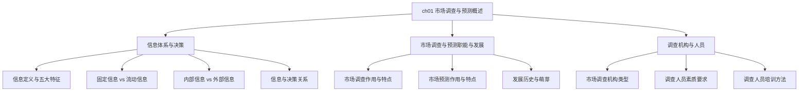

---
tags:
  - 自考/00178
  - 00178/章节/ch01
章节: ch01
章节名: 市场调查与预测概述
重要度: ★★
状态: 待核实
更新日期: 2026-09-08
---

# ch01 · 市场调查与预测概述

> 一句话定位：全书入门基础章。主要考查信息概念体系、市场调查与预测的基本职能与历史渊源、调查机构与人员管理。题型以单选、名词解释为主，偶出简答题。
> 真题定位：见 [[00-考试导航]] 高频分布表；真题考过"机构类型"（2023-10 简答）、"调查人员培训方法"（2024-04 简答）、"信息特征"（常考单选）。

## 本章知识框架

## 考点清单

| 考点 | 常考题型 | 频次/重要度 | 掌握要求 |
|---|---|---|---|
| 信息的定义与五大特征 | 单选/多选/名解 | ★★★ | 背诵记忆五大特征 |
| 固定信息 vs 流动信息 | 单选/辨析/名解 | ★★★ | 深度理解与判别 |
| 内部信息 vs 外部信息 | 单选/多选 | ★★ | 理解分类标准 |
| 决策与信息的关系 | 单选/简答 | ★★ | 理解"信息是决策的基础" |
| 市场调查与预测的作用和特点 | 单选/多选/简答 | ★★ | 掌握两者区别与联系 |
| 市场调查的萌芽与发展历史 | 单选 | ★★ | 识记代表性历史事件 |
| 市场调查机构的类型 | 简答/多选 | ★★★ | 重点背诵（2023-10真题） |
| 调查人员素质要求与培训方法 | 简答/单选 | ★★★ | 重点背诵培训方法（2024-04真题） |

## 核心考点卡（问题 → 采分点）

### Q1. 什么是信息？信息具有哪些基本特征？
**答**：信息是客观事物变化和特征的反映，是经过加工处理后对企业生产经营决策产生影响的数据和资料。
- 采分点（五大特征）：
  1. **传递性**：信息可以在时间与空间上进行转移与传播，不发生物理损耗。
  2. **共享性**：信息可以同时被多个主体所使用，且不因使用而减少。
  3. **时效性**：信息的价值随着时间的推移而衰减，过时的信息失去决策参考价值。
  4. **存储性**：信息能够通过各种载体（纸质、电子介质等）长期保存以便日后提取。
  5. **可加工性**：信息可以经过分类、筛选、计算、综合等加工转化为更有价值的情报。

### Q2. 什么是固定信息与流动信息？二者有何区别？
**答**：
- **固定信息**：是指在一定时期内相对稳定、重复发生、具有相对固定使用周期的信息（如企业规章制度、产品技术定额、历史标准、国家政策法规等）。
- **流动信息**：是指在企业生产经营活动中随时发生、不断变动、反映即时状态的信息（如每日销售额、每日出入库数量、实时价格波动等）。
- **区别要点**：
  1. **稳定性不同**：固定信息稳定期较长；流动信息动态变化快。
  2. **利用方式不同**：固定信息常作为核算与对比的基准或档案；流动信息用于日常控制与即时调整。

### Q3. 什么是内部信息与外部信息？
**答**：
- **内部信息**：来源于企业组织内部各种经营管理活动的信息，如财务报表、生产报表、销售记录、员工考勤、库存数据等。
- **外部信息**：来源于企业外部宏观环境与市场运作环境的信息，如国家政策法规、行业竞争态势、供应商变动、消费者需求偏好、科技发展动态等。

### Q4. 简述决策与信息之间的关系。
**答**：
1. **信息是科学决策的基础与前提**：没有准确、及时的信息，决策就会变成无源之水、主观臆断。
2. **决策的正确程度取决于信息的质量**：高质量的信息能降低决策的不确定性和经营风险。
3. **决策过程实质上是对信息的收集、加工、传递和反馈的过程**：贯穿于发现问题、拟定方案、优选方案到执行监控的全流程。

### Q5. 简述市场调查与预测的作用。
**答**：
1. **为企业经营决策提供科学依据**：帮助企业了解市场需求、竞争态势，制定正确的发展战略。
2. **有利于企业开拓新市场、开发新产品**：识别潜在市场机会，减少产品开发盲目性。
3. **提高企业市场竞争力与盈利能力**：精准把握营销组合策略（4P），提升资源配置效率。
4. **有利于国家和行业进行宏观调控与规划**：为产业政策制定和市场秩序维护提供支撑。

### Q6. 市场调查萌芽与发展的标志性事件有哪些？
**答**：
1. **萌芽起源**：最早有记载的市场调查活动发生在**美国**（1824 年美国《宾夕法尼亚州人报》开展的总统选举民意测验）。
2. **早期发展**：20 世纪初，美国通用汽车、杜邦等大型企业率先设立专门的市场调查部门；现代统计学和心理学逐步引入市场调查。

### Q7. 市场调查机构的主要类型有哪些？（2023-10 简答）
**答**：
1. **企业内部市场调查部门**：企业自身设立的专业部门，针对本企业产品与市场开展常规性或专项调研。
2. **专业市场调查公司（独立商业调查机构）**：专门从事市场调查业务、向客户提供有偿调查服务和研究报告的独立法人机构。
3. **广告公司与营销咨询公司**：在为客户提供广告策划、品牌推广或战略咨询时配套开展的调查机构。
4. **政府部门与官方统计机构**：国家及地方统计局、商务部门等，主要收集宏观经济与行业基础数据。
5. **高校与学术研究机构**：大学、科研院所开展的偏重学术理论与行业前沿趋势的调研组织。
6. **行业协会与商会**：代表行业利益、收集和发布行业统计信息与运行动态的非营利组织。

### Q8. 市场调查人员的素质要求与培训方法有哪些？（2024-04 简答）
**答**：
- **素质要求**：
  1. 良好的职业道德与敬业精神（客观公正、诚实守信、严守保密）。
  2. 扎实的专业知识与业务技能（掌握调查方法、统计技术及相关行业知识）。
  3. 较强的人际沟通与观察应变能力。
  4. 良好的身体素质与吃苦耐劳精神。
- **培训方法（采分重点）**：
  1. **课堂讲授法（集中授课）**：讲授调查目的、方案、问卷填答规则与职业道德。
  2. **情景模拟法（角色扮演）**：模拟访问现场，调查员相互扮演访问员与被访者进行实操演练。
  3. **现场实习法（以老带新 / 现场指导）**：由经验丰富的主管或老调查员带领新手进入实地进行观摩与实操。
  4. **案例分析法**：通过典型成功与失败调查案例，提高应对突发情况和复杂场景的能力。
  5. **试访演练（试点演练）**：在正式调查前组织小范围试访，及时纠正操作偏差。

## 易错点 / 易混辨析

| 易混组 | 区分要点 |
|---|---|
| 固定信息 vs 流动信息 | 固定信息强调**周期内稳定、多次重复使用**（如定额、规章）；流动信息强调**随时发生、动态反映当前状态**（如日销售、即时库存）。 |
| 市场调查 vs 市场预测 | 市场调查侧重于**收集现状与历史客观资料（搞清过去与现在"是什么"）**；市场预测侧重于**运用模型和推断展望未来趋势（推断未来"将怎样"）**。调查是预测的前提，预测是调查的深化。 |
| 传递性 vs 共享性 | 传递性强调空间/时间上的**位移与流动**；共享性强调多主体使用时**内容不被消耗、价值可倍增**。 |

## 真题连线

- 2023-10 简答第31题（【市场调查机构类型】）→ 详见 [[02-历年真题/2023-10]]
- 2024-04 简答第31题（【市场调查人员的培训方法】）→ 详见 [[02-历年真题/2024-04]]
- 2021-04 单选第1题（【信息的特征】）→ 详见 [[02-历年真题/2021-04]]
- 2025-04 单选（【最早有记载的调查活动发生国——美国】）→ 详见 [[02-历年真题/2025-04]]

## 背诵速记（可选）

> **信息特征五字诀**：传（传递）、享（共享）、效（时效）、存（存储）、加（可加工）。
> **调查员培训口诀**：讲授搞理论，演练做模拟；老手带新手，试访纠问题。

## 待核实清单

- [ ] 检查与教材第一章各小节标题和顺序对照【待核实】
- [ ] 确认教材中市场调查机构的权威分类术语（四类还是六类）【待核实】
