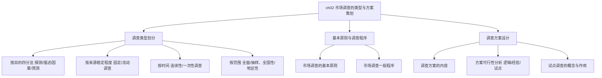

---
tags:
  - 自考/00178
  - 00178/章节/ch02
章节: ch02
章节名: 市场调查的类型与方案策划
重要度: ★★★
状态: 待核实
更新日期: 2026-09-08
---

# ch02 · 市场调查的类型与方案策划

> 一句话定位：类型学核心章。区分"按目的四分法"与各划分维度是单选、多选的常客；调查方案与试点调查是简答/论述的可能来源。
> 真题定位：2025-04 简答（什么是试点调查法，它有什么作用）；2022-10 论述（问卷设计程序，衔接 ch05）；本章还常以"四类调查判别"形式出现在单选。

## 本章知识框架

## 考点清单

| 考点 | 常考题型 | 频次/重要度 | 掌握要求 |
|---|---|---|---|
| 按目的分：探测性、描述性、因果关系、预测性调查 | 单选/多选/名解 | ★★★ | 深度理解判别（"是什么/为什么"） |
| 调查类型的划分维度 | 单选/多选 | ★★ | 理解各维度交叉 |
| 市场调查的基本原则 | 单选/简答 | ★★ | 背诵原则条目 |
| 市场调查的一般程序与步骤 | 单选/简答 | ★★ | 掌握顺序 |
| 调查方案的内容 | 单选/简答 | ★★ | 记住方案构成的"骨架" |
| 方案可行性分析的三种方法 | 单选/多选 | ★★★ | 分辨逻辑分析/经验判断/试点调查 |
| 试点调查的概念与作用 | 名解/简答 | ★★★ | 名词解释+作用（2025-04 真题） |

## 核心考点卡（问题 → 采分点）

### Q1. 简述按调查目的划分的四类市场调查。
**答**：
1. **探测性调查（探索性调查）**：当企业对问题不甚了解时，为初步查明问题的性质、范围和可能原因而进行的**非正式、初步**调查，如收集文献、征询专家意见。其**更倾向使用二手资料**和个案讨论，回答"问题是什么"。其目的在于为后续正式调查提出假设、确定方向。
2. **描述性调查**：回答**"是什么"**的问题。系统地对市场现象、消费者行为及特征进行客观描述（如市场规模、市场份额、消费者构成、购买习惯等），通常需要事先制定计划。
3. **因果关系调查**：回答**"为什么"**的问题。探讨变量之间的因果关系，如价格变动如何影响销售量。**常用实验法**（控制其他变量观察自变量的影响）。
4. **预测性调查**：回答**"将来会怎样"**的问题。在描述和因果调查基础上预测市场未来发展的趋势，是市场预测的前提和基础。

### Q2. 市场调查类型的划分有哪些维度？
**答**：
1. **按信息来源稳定程度分**：**固定调查**（固定调查对象、多次重复进行的调查）与**流动调查**（调查对象不固定，每次更换样本）。
2. **按调查时间特征分**：**连续性调查**（对市场现象持续、周期地观察记录）与**一次性调查**（只为解决特定问题而临时组织的调查）。
3. **按调查范围分**：**全面调查**（对全体对象逐一调查，如普查）与**抽样调查**（抽取部分样本推断总体）；从空间上又可分为**全国性调查**与**地区性调查**。
4. 另可**按调查目的**分为探测性、描述性、因果关系、预测性四类（即 Q1）。

### Q3. 简述市场调查的基本原则。
**答**：
1. **实事求是原则**：如实反映客观情况，不弄虚作假，不以主观臆断代替事实。
2. **系统性原则**：用系统观点分析市场，全面考虑各影响因素之间的相互联系。
3. **时效性原则**：调查要在规定时间内完成，保证资料的及时性，避免时过境迁。
4. **经济性原则**：在保证调查质量的前提下，尽量节约人力、物力和财力。
5. **保密性原则**：对被调查者的信息和调查所获资料妥善保管，不得随意泄露。

### Q4. 简述市场调查的一般程序（步骤）。
**答**：
1. **确定调查目的与任务**：明确要解决什么问题，是整个调查工作的出发点。
2. **初步情况分析（非正式调研）**：围绕问题进行初步资料收集，缩小调查范围。
3. **制定调查方案与计划**：确定调查对象、方法、工具、时间、经费与人员安排。
4. **设计调查工具（问卷、访谈提纲等）并进行预试**：在小范围试访中检验工具的科学性。
5. **实施调查、收集资料**：按计划组织实地调查，做好质量控制与进度监控。
6. **整理分析资料**：对资料进行校编、分类、编码、录入与统计分析，得出结论。
7. **撰写调查报告**：将调查结论以书面或演示形式呈现给决策者并跟踪应用效果。

### Q5. 市场调查方案主要包括哪些内容？
**答**：一份完整的调查方案应包含（可根据题目灵活作答 4-6 点）：
1. **调查目的与任务**：说明为什么调查、解决什么问题。
2. **调查对象与调查单位**：明确向谁调查、谁是提供资料的单位。
3. **调查内容与调查项目**：把总目标分解为具体项目与指标体系。
4. **调查方式与方法**：全面调查还是抽样调查、文案法还是访问法/观察法/实验法。
5. **调查工具与量表设计**：问卷、量表、观察记录表、访问提纲等。
6. **调查时间与工作进度安排**：包括资料收集期与各阶段日程。
7. **经费预算与人员组织安排**：调查队伍的组织、分工、培训与经费保障。
8. **资料整理分析方法**：预先规定数据的处理与统计方法。
9. **调查的组织保障与质量控制措施**：保证方案顺利实施。

### Q6. 调查方案可行性分析的常用方法有哪些？
**答**：
1. **逻辑分析法**：用逻辑推理审视调查方案在内容、目标、方法之间是否自洽、有无前后矛盾（不花钱、速度快，但不能发现所有问题）。
2. **经验判断法**：凭借有经验的专业人士对方案是否符合实际作出判断，速度快但依赖个人经验。
3. **试点调查法（试调查法）**：选择少数典型单位试运行整个方案，实地检验其可行性，是最直接、最可靠的方法。

### Q7. 什么是试点调查法？为什么要进行试点调查？（2025-04 简答）
**答**：
- **定义**：试点调查（试验性调查）是指在正式调查之前，选择一个或几个具有代表性的单位（或小范围样本），按照正式调查方案进行一次小规模的试验性调查，以检验方案可行性的一种方法。
- **作用（"为什么"采分点）**：
  1. **检验调查方案的可行性**：及早发现方案设计中的问题（如项目不全、口径不清、方法不当）并及时修正。
  2. **检验调查工具的科学性**：检验问卷题目是否被理解、量表是否有效、记录表是否实用。
  3. **检验调查组织工作的衔接性**：检验队伍分工、进度安排与物资准备是否合理。
  4. **积累组织实施经验、培训调查人员**：使调查员在正式调查前熟悉流程、统一口径，提高访问技巧。
  5. **为估算正式调查工作量与费用提供依据**：通过试点推算人、财、物的实际消耗，使预算更准确。

## 易错点 / 易混辨析

| 易混组 | 区分要点 |
|---|---|
| 探测性 vs 描述性调查 | 探测性是**前期、非正式、探索性质**（不知问题为何物时用，偏二手资料）；描述性是**正式、系统**回答"是什么"。探测性往往先于描述性。 |
| 因果关系 vs 预测性调查 | 因果关系研究**现在**的"为什么"（变量间因果）；预测性研究**未来**的"会怎样"，通常以前两类调查结论为基础。 |
| 固定调查 vs 流动调查 | 固定=样本**固定不变**多次重复追踪；流动=样本**不固定**随每次调查更换。 |
| 连续性 vs 一次性调查 | 连续性强调**周期反复**观察记录；一次性强调**一次性**完成、解决特定问题。 |
| 全面调查 vs 抽样调查 | 全面=对**全体**逐一调查（费时费力费钱）；抽样=抽**一部分**推断总体（常用、经济）。 |
| 逻辑分析 vs 经验判断 vs 试点调查 | 逻辑分析=**推理自洽性**检验；经验判断=**专家经验**把关；试点调查=**实地小规模试运行**（最可靠但最花钱）。 |

## 真题连线

- 2025-04 简答第34题（【什么是试点调查法及其作用】）→ 详见 [[02-历年真题/2025-04]]
- 2022-10 论述（【问卷设计程序：第一步确定收集资料的目的，衔接本章方案设计】）→ 详见 [[02-历年真题/2022-10]]
- 2023-04 单选（【四类调查目的判别】）→ 详见 [[02-历年真题/2023-04]]
- 2024-04 单选/多选（【按范围、按时间划分调查类型】）→ 详见 [[02-历年真题/2024-04]]

## 背诵速记（可选）

> **目的四分法口诀**：探测"是什么事儿"、描述"是什么样"、因果"为什么变"、预测"将来咋样"。
> **可行性三法口诀**：逻辑靠推理、经验靠人脑、试点靠实践（试点最可靠）。

## 待核实清单

- [ ] 确认教材对"市场调查基本原则"的条目表述（条目数量与文字）
- [ ] 调查程序步骤在教材中的章节归属（ch02 还是 ch07）与顺序【待核实】
- [ ] 试点调查法的教材标准定义文字【待核实】
