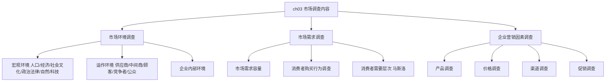

---
tags:
  - 自考/00178
  - 00178/章节/ch03
章节: ch03
章节名: 市场调查内容
重要度: ★★★
状态: 待核实
更新日期: 2026-09-08
---

# ch03 · 市场调查内容

> 一句话定位：内容体系章，单选归类题重灾区。考题风格高度固定——"××调查属于哪一类环境/因素调查"，务必把每个归类的边界记死。
> 真题定位：见 [[00-考试导航]] 高频分布表（宏观/运作环境判别★、产品/促销/渠道归类★）；真题大量以"下列调查属于宏观环境调查的是""中间商调查属于——"形式出现。

## 本章知识框架

## 考点清单

| 考点 | 常考题型 | 频次/重要度 | 掌握要求 |
|---|---|---|---|
| 宏观环境六大因素归类 | 单选/多选 | ★★★ | 每个因素配典型例子 |
| 运作环境五大主体归类 | 单选/多选 | ★★★ | 中间商属运作环境 |
| 企业内部环境调查 | 单选 | ★ | 识记 |
| 市场需求调查与需求容量要素 | 单选/简答 | ★★ | 要素记忆 |
| 消费者购买行为调查与马斯洛层次 | 单选/多选 | ★★★ | 顺序背诵 |
| 产品/价格/渠道/促销调查归类 | 单选/多选 | ★★★ | 促销三项是陷阱高发区 |
| 市场印象调查的归类 | 单选 | ★ | 辨析归类【待核实】 |

## 核心考点卡（问题 → 采分点）

### Q1. 宏观环境调查包括哪些因素？各有何内容？
**答**（六大因素，常出多选/归类题）：
1. **人口环境**：人口总量、人口构成（年龄、性别、民族、职业、受教育程度）、人口地理分布与流动趋势。
2. **经济环境**：国民收入、人均收入、消费结构与支出模式、物价水平、储蓄与信贷等。（**注意**：消费者支出模式在教材中归入经济环境，**不属于社会文化因素**【待核实，按教材表述核对】。）
3. **社会文化环境**：教育文化水平、价值观念、消费习惯与风俗、宗教信仰、道德观念等。
4. **政治法律环境**：国家方针政策、法律法规、政治局势与政府管制措施。
5. **自然环境**：自然资源、地理气候条件、生态环境与环保要求。
6. **科学技术环境**：科技发展水平、新技术新材料应用、产品科技含量及其变化。

> ⚠️ 易混提示：考生常把"消费者支出模式/消费结构"误归社会文化环境；按教材应归**经济环境**（支出能力属经济因素）。社会文化环境强调**观念、习惯、信仰、教育**等软性社会因素。

### Q2. 运作环境（竞争环境）调查包括哪些主体？中间商调查属于哪类？
**答**：运作环境调查围绕企业与市场的直接交易关系展开，主要包括：
1. **供应商调查**：货源、供货能力、供货价格与信用条件等。
2. **中间商调查**：批发商、零售商等渠道成员的经营能力、信誉、覆盖网络与协作关系。
3. **顾客调查**：顾客构成、需求特点、购买行为与满意度。
4. **竞争者调查**：竞争对手的数量、规模、产品、价格、渠道、促销策略及市场地位。
5. **公众调查**：政府公众、媒介公众、社区公众、金融公众、内部公众等对本企业的态度与要求。
> **结论**：**中间商调查属于运作环境调查**（运作环境中的"中间商"主体），不属于宏观环境调查——这是高频归类陷阱。

### Q3. 企业内部环境调查包括哪些内容？
**答**：
1. **企业资源条件**：资金、技术、设备、原材料与人力资源状况。
2. **企业经营管理能力**：组织架构、管理水平、销售力量与信息系统的完备程度。
3. **企业产品与市场地位**：本企业产品结构、市场占有率、品牌影响及营销业绩的历史与现状。
（企业内部环境调查常作为分析企业经营优劣势的资料基础。）

### Q4. 市场需求调查主要调查什么？影响需求容量的要素有哪些？
**答**：
- 市场需求调查的核心是摸清**现实需求与潜在需求**的总量、结构与变化趋势，包括需求量、需求结构与消费特点。
- **需求容量的三要素**（教材表述【待核实】：以"人口构成"等为基础）：
  1. **人口构成**：人口数量、年龄性别结构、地理分布等决定需求总量的基础因素。
  2. **购买力水平**（待核实措辞）：居民收入与消费支出能力。
  3. **购买欲望与消费倾向**（待核实措辞）：影响潜在需求能否转化为现实购买。
> ⚠️ 三要素的确切名称、表述请以教材原文核对；冲刺阶段至少记住"人口构成"必考其一。

### Q5. 简述消费者购买行为调查内容与马斯洛需要层次。
**答**：
- 消费者购买行为调查包括：购买动机、购买习惯（购买时间/地点/频次/数量）、购买决策过程、影响购买的因素，以及对商品的品牌忠诚度与满意度。
- **马斯洛需要层次（由低到高顺序背诵）**：
  1. **生理需要**（吃穿住用，最低层次）
  2. **安全需要**
  3. **社交需要（归属与爱的需要）**
  4. **尊重需要**
  5. **自我实现需要**（最高层次）
> 考法：单选给顺序让选"由低到高第X层"或"最高层次是"；多选让挑"属于社交需要的有"。

### Q6. 企业营销因素调查（4P 调查）各包括什么？
**答**：
1. **产品调查**：产品**品牌**知名度与美誉度、产品**生命周期**阶段（导入/成长/成熟/衰退）判断、产品品质与包装、新产品开发可行性，以及**服务的设计与营销**（售前/售中/售后服务）。
2. **价格调查**：价格水平与变动、成本构成、需求价格弹性、竞争者价格与消费者价格心理（价格敏感度）。
3. **渠道调查**：分销渠道结构、中间商选择、物流储运，重点包括**顾客对渠道服务的要求**（送货是否及时、服务是否便利等）。
4. **促销调查**：**媒体选择与组合**（哪类媒体覆盖面广、成本低）、**广告效果**测定（注意度、记忆度、购买行为转化）、**人员推销**管理、营业推广与公共关系活动的效果。
> ⚠️ **高频归类陷阱**："媒体选择与组合、广告效果、人员推销"均属**促销调查**；广告与推销是促销组合的内容，别误归产品/渠道调查。

### Q7. 市场印象调查属于哪一类市场调查内容？
**答**：
- 市场印象调查（消费者对本企业形象、品牌形象的认知与评价调查）属于企业形象的调查内容【待核实：教材章节归类与准确名称】。
- 辨析：它**不属于**宏观环境调查（无宏观政策性质），也不直接等于产品调查（测的是"消费者眼中的形象"而非产品物理属性）；冲刺阶段重点记住题干用词与教材归类的对应关系，遇到选项先看"主体是企业自己 vs 外部环境"。
> ⚠️ 本考点归类依据教材原文，暂标待核实，回填时以教材页码为准。

## 易错点 / 易混辨析

| 易混组 | 区分要点 |
|---|---|
| 宏观环境 vs 运作环境 | 宏观环境是**企业不可控的间接大环境**（人口/经济/社会文化/政法/自然/科技）；运作环境是**企业可直接互动的市场交易主体**（供应商/中间商/顾客/竞争者/公众）。判断口诀：看对象是否与买卖流通直接相关。 |
| 经济环境 vs 社会文化环境 | "消费者支出模式/消费结构/收入"→**经济环境**；"价值观/风俗/信仰/教育水平/消费习惯"→**社会文化环境**。 |
| 促销调查 vs 产品调查 | 促销调查管**传播与沟通**（媒体选择与组合、广告效果、人员推销）；产品调查管**卖什么**（品牌、生命周期、服务设计）。 |
| 渠道调查中的"中间商调查" | 在环境体系里中间商属**运作环境**；在 4P 里渠道调查研究中间商选择与顾客对渠道的服务要求——两处定位不同，看清题干问的是"环境归类"还是"营销因素归类"。 |

## 真题连线

- 2023-04 单选（【宏观/运作环境因素归类】）→ 详见 [[02-历年真题/2023-04]]
- 2024-10 单选（【中间商调查属于运作环境调查】）→ 详见 [[02-历年真题/2024-10]]
- 2025-04 单选（【媒体选择与组合属于促销调查】）→ 详见 [[02-历年真题/2025-04]]
- 2023-10 单选/多选（【马斯洛需要层次 / 需求容量人口构成】）→ 详见 [[02-历年真题/2023-10]]

## 背诵速记（可选）

> **宏观环境六字诀**：人经社政法科（人口、经济、社会文化、政治法律、自然、科技）。
> **运作环境口诀**：供应商、中间商，顾客竞争加公众——都是"站在企业门口的人"。
> **马斯洛口诀**：生安社尊我（生理→安全→社交→尊重→自我实现）。
> **促销三件套**：媒体选择组合、广告效果、人员推销——看见这三样就选"促销调查"。

## 待核实清单

- [ ] 教材对"消费者支出模式"归属的原文（经济环境/社会文化环境）页码
- [ ] 需求容量三要素的教材原文表述（人口构成之外的另两要素名称）
- [ ] 市场印象调查在教材中的章节归类与准确名称
