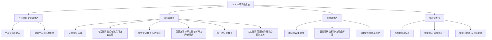

---
tags:
  - 自考/00178
  - 00178/章节/ch04
章节: ch04
章节名: 市场调查方法
重要度: ★★★
状态: 待核实
更新日期: 2026-09-08
---

# ch04 · 市场调查方法

> 一句话定位：全书主观题"大户章"（简答、论述、名解的绝对高发区）。四大方法（文案/访问/观察/实验）各具考点，优缺点与适用条件是必背核心。
> 真题定位：2025-04 简答"收集二手资料的要求"、名解"深度询问"、单选"词语联想法属投射技术"；2023-10/2024-10 简答"二手资料"；2023-04 论述"网上访问优缺点"；2021-04 论述"实验室实验与现场实验"。

## 本章知识框架

## 考点清单

| 考点 | 常考题型 | 频次/重要度 | 掌握要求 |
|---|---|---|---|
| 二手资料（文案法）优缺点与收集要求 | 简答/单选 | ★★★ | 连续多期真题，背诵要求条目 |
| 访问调查法家族各类型优缺点比较 | 简答/论述/单选 | ★★★ | 邮寄/电话/留置/网上访问特性必背 |
| 深度询问法 | 名解/单选 | ★★★ | 概念与适用（2025-04名解） |
| 焦点座谈会（座谈会法） | 单选/简答 | ★★ | 特点与组织要求 |
| 投射技术（自由联想/词语联想等） | 单选/名解 | ★★★ | 2025-04单选：测本能倾向与潜意识 |
| 观察调查法各具体形态 | 单选/多选 | ★★ | 痕迹观察、神秘顾客、单向镜判别 |
| 实验调查法基本要素与四大特点 | 单选/多选/简答 | ★★ | 主动性/客观性/复杂性/控制性 |
| 预实验 vs 真实验设计 | 单选/多选/辨析 | ★★★ | 后测/前后测/对照组判别 |
| 实验室实验 vs 现场实验 | 论述/简答/辨析 | ★★★ | 2021-04论述，全面对比优缺点 |

## 核心考点卡（问题 → 采分点）

### Q1. 什么是二手资料？二手资料（文案调查法）的优缺点是什么？
**答**：
- **定义**：二手资料（间接资料）是指由他人为了其他目的已经收集、记录、整理好的现有资料（文案调查法即二手资料的收集与分析）。
- **优点**：
  1. **获取成本低、费用省**：无需组织大规模实地调查人员。
  2. **获取速度快、省时**：现成可用，能迅速满足初步研究需求。
  3. **获取范围广、信息量大**：能获得企业自身难以收集的宏观和历史数据。
  4. **对被调查者无干扰**：纯案头工作，不直接接触调查对象。
- **缺点**：
  1. **针对性较差**：原本并非为本次研究专门收集，往往不够契合。
  2. **时效性较弱**：数据可能滞后，不能反映最新市场动态。
  3. **准确度与可靠性难以完全把握**：收集者的口径、方法和偏见可能难以查证。
  4. **定义与统计单位可能不一致**：数据口径和分类标准常与本次调查不匹配。

### Q2. 收集二手资料的基本要求有哪些？（2023-10 / 2024-10 / 2025-04 简答常客）
**答**（必须严格掌握的采分点）：
1. **充分性（完整性）**：收集的资料内容必须全面、系统，能满足研究的基本需要，不能断章取义。
2. **相关性（针对性）**：资料必须与当前调查课题的目标和内容紧密相关，舍弃无关冗余信息。
3. **准确性（真实性/可靠性）**：资料来源必须权威、数据真实可靠，需查核其原始出处、收集方法与统计口径。
4. **时效性（新颖性）**：资料应当反映近期的最新情况，过时陈旧的资料不能作为决策依据。
5. **经济性（合算性）**：收集资料所耗费的时间和费用应与资料的利用价值相适应。

### Q3. 比较访问调查法主要形式的优缺点。
**答**：
1. **人员访问（面谈访问）**：
   - 优点：灵活性最高、回答率高、可追问、可观察受访者非语言反应、可出示卡片或样品。
   - 缺点：成本最高、耗时长、对访问员技能要求高、容易产生访问员主观偏差（访问员效应）。
2. **电话访问**：
   - 优点：速度快、成本较低、覆盖面广、易于监控管理。
   - 缺点：访问时间必须短（通常控制在10~15分钟以内）、**不宜采用复杂的自由题（开放式问题）**、无法展示样品或视觉资料、容易被拒访。
3. **邮寄访问**：
   - 优点：费用低、覆盖范围极广、受访者可从容填答避开主观偏见、隐私性好。
   - 缺点：**问卷回收率低（最突出缺点）**、周期长、填答质量无法现场控制、对受访者文化水平有要求。
4. **留置访问（入户留置）**：
   - 特点：调查员登门送交问卷，向受访者说明填写要求后离开，约定时间再登门收回。**介于人员访问与邮寄访问之间**。
   - 优点：回收率远高于普通邮寄；受访者有充裕时间思考；**适合代填式问卷或较长复杂的问卷**。
   - 缺点：费用和时间仍较高；仍可能存在他人代填问题。
5. **网上访问（网络调查法）**（2023-04 论述）：
   - 优点：速度极快、成本极低、自动录入与统计、不受地域限制、支持多媒体展示。
   - 缺点：样本代表性受网民结构偏差影响；填答随意性较大、作弊不易防范；缺乏面对面人际信任。

### Q4. 什么是深度询问法？（2025-04 名解）
**答**：深度询问法（深访法）是一种非结构化、直接的人际访问调查方法。由经过高度专业训练的访问员，围绕特定调研主题，与单个受访者进行面对面、深入探询的个别交谈。
- **采分补充**：旨在揭示受访者潜在的动机、信仰、态度和深层次感受，适用于探索性研究、保密性强或敏感性强的调查课题。

### Q5. 什么是投射技术（投影技巧）？常见方法有哪些？（2025-04 单选）
**答**：
- **定义**：投射技术是一种无结构的、间接的定性调查方法。通过向受访者呈现模糊、没有明确指向的刺激物，让受访者在无意识中把自己的潜在心理、动机、情感和态度"投射"出来（测本能倾向与潜意识）。
- **常见类型**：
  1. **自由联想法 / 词语联想法**：主试念出一个词（如"面包"），让受访者立即说出脑海里出现的第一个词。
  2. **句子完成法 / 故事完成法**：提供一个未完成的句子或故事片段，让受访者补齐。
  3. **角色扮演法**：让受访者置身于某种情境或扮演某角色发表观点。
  4. **漫画测验 / 拟人法**：让受访者为漫画中的人物填写对话或气泡。

### Q6. 观察调查法有哪些典型形态？
**答**：
1. **神秘顾客法**：经过培训的调查员伪装成普通顾客，深入营业场所亲身体验并评估服务质量与流程。
2. **单向镜观察法**：调查员透过单向透视玻璃观察受访者（如座谈会或儿童玩具测试）的真实自然反应。
3. **痕迹观察法**：通过对人类过去行为所留下的物理痕迹进行检验来推测行为。典型例子包括**蚀损物观察**（如博物馆某展柜地砖磨损程度反映受欢迎度）和**垃圾分解法**（通过家庭生活垃圾推测真实消费品牌与数量）。
4. **购买模式观察法与人种学观察法**：在自然生活情境中长期跟踪观察消费者的行为模式与生活方式。

### Q7. 简述实验调查法的基本要素与四大特点。
**答**：
- **基本要素**：
  1. **自变量（实验刺激）**：由实验者主动操纵的营销变量（如改变价格、包装）。
  2. **因变量（观测变量）**：受自变量影响而发生变化的结果变量（如销售量、品牌知名度）。
  3. **实验对象（受试单位）**：接受实验处理的个体、商店或市场。
  4. **处理组（实验组）**：接受自变量操纵的组。
  5. **对照组（控制组）**：不接受自变量操纵、用作对比基准的组。
- **四大特点**：
  1. **主动性**：研究者主动操纵自变量，而非被动等待。
  2. **客观性**：通过对比测量直接反映变量之间的因果效应。
  3. **复杂性**：外部干扰因素多，难以做到完全绝缘。
  4. **控制性**：必须对无关变量（外生变量）进行严格控制以防污染结果。

### Q8. 比较预实验设计与真实验设计。
**答**：
1. **预实验设计**：控制性最弱的初级设计，缺乏对照组或缺乏随机分配，无法排除外生变量影响。
   - 典型形式：**简单后测设计**（无对照、无前测，仅对处理后结果观测一次）；**简单前后测设计**（单组进行实验前与实验后测定，差值易受历史/成熟效应干扰）。
2. **真实验设计**：具有随机分组（R）并设立严格对照组的科学设计，能有效控制外生变量。
   - 典型形式：**对照后测设计**（随机分配处理组与对照组，仅测后测）；**对照前后测设计**（经典设计，两组均测前后测，取差值的差）。

### Q9. 比较实验室实验与现场实验的优缺点。（2021-04 论述）
**答**：
- **实验室实验**：
  - 含义：在人工创造的高度受控环境中进行的实验（如模拟超市、专用实验室）。
  - 优点：外生变量控制严格、内部有效度（内部效度）高、保密性好、成本相对较低。
  - 缺点：环境过于人工化，受试者有心理防备（霍桑效应），外部有效度（结果推广到真实市场的程度）较差。
- **现场实验（实地实验）**：
  - 含义：在真实的自然市场环境中进行的实验（如试销、真实货架调整）。
  - 优点：情境真实自然，外部有效度高，结论更贴合实际市场反应。
  - 缺点：外部竞争与环境无法完全控制、内部有效度受干扰、容易被竞争对手知晓并破坏、费用高、耗时长。

## 易错点 / 易混辨析

| 易混组 | 区分要点 |
|---|---|
| 预实验 vs 真实验 | 关键标志看**有无随机分配（R）与对照组**。真实验有随机化对照组；预实验无对照组或非随机化。 |
| 电话访问 vs 邮寄访问缺点 | 电话访问突出缺点是**不宜问复杂自由题、时间受限**；邮寄访问突出缺点是**回收率低、周期长**。 |
| 留置访问地位 | **介于人员访问与邮寄访问之间**；调查员送问卷并指导，受访者自填，调查员随后取回。 |
| 深度询问 vs 焦点座谈会 | 深度询问是**一对一、单人深挖**；焦点座谈会是**一对多（通常6~12人）群体互动**。 |
| 词语联想法性质 | 属于**投射技术（间接定性方法）**，绝不能选成量表测量或态度直接测定。 |
| 实验室实验 vs 现场实验效度 | 实验室实验**内部有效度高、外部有效度低**；现场实验**内部有效度低、外部有效度高**。 |

## 真题连线

- 2025-04 简答第31题（【收集二手资料的基本要求】）→ 详见 [[02-历年真题/2025-04]]
- 2025-04 名词解释第26题（【深度询问法】）→ 详见 [[02-历年真题/2025-04]]
- 2025-04 单选第5题（【词语联想法属于投射技术】）→ 详见 [[02-历年真题/2025-04]]
- 2024-10 简答（【二手资料优缺点/收集要求】）→ 详见 [[02-历年真题/2024-10]]
- 2023-10 简答（【二手资料收集要求】）→ 详见 [[02-历年真题/2023-10]]
- 2023-04 论述第36题（【网上访问调查法的优缺点】）→ 详见 [[02-历年真题/2023-04]]
- 2021-04 论述第36题（【实验室实验与现场实验的优缺点对比】）→ 详见 [[02-历年真题/2021-04]]

## 背诵速记（可选）

> **二手资料五要求**：充、关、准、效、经（充分、相关、准确、时效、经济）。
> **访问法短板记**：邮寄愁回收，电话怕自由（题），人员花钱多，留置跑两趟。
> **实验设计口诀**：无对照为预实验，随机对照真实验；室内内部效度高，实地外部好推广。

## 待核实清单

- [ ] 核对教材中对"收集二手资料要求"各采分点的官方小标题措辞
- [ ] 确认实验调查法四类设计分类标准（预实验、真实验、准实验在教材中的详略）
- [ ] 投射技术四种分类在教材中的具体命名
