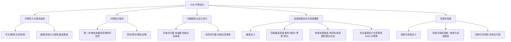

---
tags:
  - 自考/00178
  - 00178/章节/ch05
章节: ch05
章节名: 问卷设计
重要度: ★★★
状态: 待核实
更新日期: 2026-09-08
---

# ch05 · 问卷设计

> 一句话定位：全书技术性最强、主客观题均处于绝对核心地位的章节。量表四层级运算、信度效度关系是必考概念；问卷设计程序是论述题原题。
> 真题定位：2022-10 论述"问卷设计程序"（第一步确定收集信息资料的目的）；2023-04 名解"量表"；2026-04 简答"设计评比量表注意问题"；单选每卷必考 1~2 道量表层级与信度效度。

## 本章知识框架

## 考点清单

| 考点 | 常考题型 | 频次/重要度 | 掌握要求 |
|---|---|---|---|
| 问卷的含义与四大部分构成 | 单选/简答 | ★★★ | 记住核心：最基本部分是"主体（问题和备选答案）" |
| 问卷设计程序（步骤） | 论述/简答/单选 | ★★★ | 2022-10 论述原题，第一步必考 |
| 开放式问题（自由题）vs 封闭式问题 | 单选/简答/辨析 | ★★★ | 优缺点与适用场景对比 |
| 态度测量与"量表"的定义 | 名解/单选 | ★★★ | 2023-04名解，精准默写 |
| 四类量表层级与数学特性 | 单选/多选/辨析 | ★★★ | 类别<顺序<等差<等比，允许运算必考 |
| 李克特量表、语意差别量表、配对比较量表 | 单选/简答 | ★★★ | 掌握各自表现形式与优点 |
| 设计评比量表应注意的问题 | 简答 | ★★★ | 2026-04 简答原题，背诵条目 |
| 信度与效度的关系及与误差的对应 | 单选/名解/辨析 | ★★★ | 信度=随机误差，效度=系统误差 |

## 核心考点卡（问题 → 采分点）

### Q1. 问卷的基本结构包括哪些部分？最基本的部分是什么？
**答**：
- **问卷的基本结构（通常分为四大组成部分）**：
  1. **开头部分**：包括问候语、填表说明、调查目的及对受访者的保密承诺（消除受访者疑虑、争取合作）。
  2. **甄别部分（过滤题/配额筛选）**：用于确认受访者是否属于目标调查对象，排除不合格个体。
  3. **主体部分（核心部分）**：围绕调查目标设计的具体问题和备选答案，是问卷最核心、篇幅最大的内容。
  4. **背景部分（受访者个人特征资料）**：包括受访者性别、年龄、职业、受教育程度、家庭收入等人口统计学变量（通常置于问卷末尾，避免引起受访者一开始的戒备）。
- **核心结论**：问卷最基本、最核心的部分是**问题和备选答案**（主体部分）。

### Q2. 简述问卷设计的完整程序。（2022-10 论述原题）
**答**：
1. **确定收集信息资料的目的（第一步，最关键基础）**：明确本次调查需要回答什么问题、需要哪些具体数据支撑。
2. **确定调查方式与问卷发放方式**：是人员面访、电话访问、邮寄问卷还是网络调查（调查方式直接决定问卷长短与题型设计）。
3. **确定问题的内容**：根据调查目的，列出需要调查的问题清单，剔除无关问题。
4. **确定问题的类型与结构**：决定采用开放式问题还是封闭式问题（单选、多选、量表等）。
5. **拟定问题的文字表述**：措辞要通俗、简练、客观中立，避免诱导性语言、否定双重否定或歧义用词。
6. **确定问卷的顺序与布局**：按由易到难、由浅入深、逻辑连贯的原则排列问题（敏感背景题放最后）。
7. **问卷的预试与修改**：进行小范围试访（试点），发现问题并修改完善。
8. **印制问卷、正式定稿**：排版清晰规范，正式印制交付使用。

### Q3. 开放式问题（自由题）与封闭式问题各有何优缺点及适用场景？
**答**：
- **开放式问题（自由题）**：
  - 含义：不设固定备选答案，由受访者用自己的语言自由表达意见。
  - 优点：受访者不受限制，能收集到深层次、丰富、新颖的见解。
  - 缺点：对受访者表达能力要求高；受访者耗费精力大；回答离散度高，**后期校编、编码、统计极其困难**；**不适合电话调查**。
  - 适用：探索性研究、小样本调查、深度访谈、调查前期的假设生成。
- **封闭式问题（结构化问题）**：
  - 含义：同时给出问题和预设的备选答案，受访者从中挑选。
  - 优点：填答简单省时、受访者不易疲劳、回答标准化、便于编码与计算机统计分析。
  - 缺点：限制了受访者的发挥空间；选项若设计不全容易遗漏重要信息；受访者可能随意猜测盲选。
  - 适用：大规模抽样调查、描述性与因果性调查、电话访问与自填式网络问卷。

### Q4. 什么是量表？（2023-04 名解）
**答**：量表是指在市场调查和心理测量中，按照特定的规则，将客观事物或受访者的态度、观点、偏好和情感等抽象特征，赋予一定的数值或符号，使其能够被度量和统计分析的一种测量工具。

### Q5. 四类测量量表的层级、特征与数学运算权限是什么？
**答**（四类量表层级由低到高，高层级具备低层级所有功能）：
1. **类别量表（名义量表，最低级工具）**：
   - 特征：仅用数字或符号来对事物进行**分类和识别**，数值无大小、先后或优劣意义（如：1=男，2=女；球员球衣号码）。
   - 数学运算：**只能计数（频数、百分比、众数）**，绝对不能进行加减乘除运算。
2. **顺序量表（等级量表）**：
   - 特征：既能分类，又能表示事物之间的**顺序、高低或优劣等级关系**，但各级之间的间距不一定相等（如：产品满意度 1=不满意、2=一般、3=满意；受教育程度）。
   - 数学运算：可以计算**百分比、众数、中位数**和等级相关系数；不能进行加减运算（因为级差不等）。
3. **等差量表（区间量表）**：
   - 特征：既有顺序关系，又有相等的测量单位（间距相等），可以比较差异大小；但**没有绝对零点（只有相对人为零点）**（典型例子：**摄氏温度、华氏温度**；0℃ 不代表没有温度）。
   - 数学运算：可以进行**加减运算**，可计算**均值、方差、标准差**；**不能进行乘除运算**（不能说 20℃ 是 10℃ 的两倍热）。
4. **等比量表（比率量表，最高级量表）**：
   - 特征：具备前三种量表的所有特征，且**拥有绝对（真正的）客观零点**（典型例子：年龄、体重、身高、销售额、市场占有率；0 元代表完全没有钱）。
   - 数学运算：**可以进行全部四则运算（加减乘除）**，可以使用所有的统计分析方法（包括几何平均数）。

### Q6. 常见态度测量量表有哪些？各自特点是什么？
**答**：
1. **李克特量表（总加量表）**：
   - 形式：由一系列陈述语句组成，受访者根据赞同程度选择（通常采用 5 点式：非常同意、同意、中立、不同意、非常不同意）。
   - 特点：**研究消费者态度、意见和偏好中最常用**的量表，易于编制与填答，可靠性高。
2. **语意差别量表**：
   - 形式：由两极相反的形容词对（如"昂贵—便宜""现代—传统"）组成，中间设置若干等级（通常 5~7 级），受访者标出位置。
   - 特点：常用于品牌形象、企业形象（CIS）测试。
3. **配对比较量表**：
   - 形式：将所有评价对象两两配对，让受访者在每对中挑选一个更偏好的对象。
   - 特点：适合评价对象较少（通常不超过 10 个）的相对排序。

### Q7. 设计评比量表时应注意哪些问题？（2026-04 简答）
**答**：
1. **量表级数的确定**：级数不能过多也不能过少，通常以 **5~7 级**最为适宜（级数过多受访者难以分辨，过少信息区分度不够）。
2. **奇数级与偶数级的选择**：奇数级允许有"中立/无意见"的中点；偶数级则强迫受访者作出倾斜选择（迫选式）。应根据调查目的合理取舍。
3. **平衡量表与非平衡量表的选择**：通常应保证正面态度与负面态度选项数量对称（平衡量表）；若已知态度普遍倾斜，可采用非平衡量表。
4. **量表两端锚定词（极端用词）的选择**：两端的形容词必须对称对立，语义界限清晰，避免出现多义性。
5. **是否提供"不知道/不适用"选项**：当部分受访者可能确实缺乏经验时，应提供该选项以防胡乱填答污染数据。
6. **物理布局与视觉引导**：横向或纵向排版要符合阅读习惯，符号和数字赋值应方向一致（如统一以高分代表好）。

### Q8. 什么是测量的信度与效度？二者与误差的关系是什么？
**答**：
- **概念定义**：
  - **信度（可靠性）**：是指使用同一测量工具对同一对象反复测量时，所得结果的**一致性或稳定性**程度。
  - **效度（有效性）**：是指测量工具能够真正测出所要测量的特质或概念的**准确程度**。
- **与误差的对应关系（高频考点★）**：
  - **信度反映的是随机误差的大小**：信度高说明**随机误差小**；反之随机误差大。
  - **效度反映的是系统误差的大小**：效度高说明**系统误差小**（测得准、没有方向性偏差）；反之系统误差大。
- **信度与效度的辩证关系（四种组合）**：
  1. **信度是效度的必要条件，但不是充分条件**：测量有效必定可靠（有效必可靠）；但测量可靠不一定有效（如一把刻度均匀缩短的尺子，多次量结果高度一致即信度高，但每次都偏短即无效）。
  2. **"有效但不可靠"**：在实际测量中表现为**系统误差小、但随机误差大**（数据散布在真实值周围但分散）。
  3. **最理想状态**：信度高且效度高（随机误差小、系统误差也小）。

## 易错点 / 易混辨析

| 易混组 | 区分要点 |
|---|---|
| 类别量表 vs 顺序量表 | 类别量表数字**仅为代号，无优劣高低**（男女）；顺序量表有**明确的高低等级排序**（满意度），但等级差不等。 |
| 等差量表 vs 等比量表 | 关键看**有无绝对零点**。等差量表是人为相对零点（如 0℃，能加减不能乘除）；等比量表有绝对零点（如 0 元，能加减乘除）。 |
| 信度 vs 效度 | 信度是**测得稳不稳**（抗随机干扰，一致性）；效度是**测得准不准**（是否偏离靶心，准确性）。 |
| 问卷主体 vs 背景 | 主体是**调查的核心问题**；背景是**被调查者人口统计特征**（通常放最后，减少防备心理）。 |
| 开放式 vs 封闭式在电话调查中的适用 | **电话调查绝不适宜大量使用复杂的开放式自由题**，会造成长时间沉默与沟通断裂。 |

## 真题连线

- 2026-04 简答（【设计评比量表应注意的问题】）→ 详见 [[02-历年真题/2026-04]]
- 2023-04 名词解释第28题（【量表】）→ 详见 [[02-历年真题/2023-04]]
- 2022-10 论述第36题（【问卷设计的程序与步骤，第一步确定收集资料的目的】）→ 详见 [[02-历年真题/2022-10]]
- 2024-04 单选（【四类量表的层级与允许运算】）→ 详见 [[02-历年真题/2024-04]]
- 2025-04 单选（【信度与随机误差、效度与系统误差的关系】）→ 详见 [[02-历年真题/2025-04]]
- 2021-04 单选（【李克特量表的定义与特点】）→ 详见 [[02-历年真题/2021-04]]

## 背诵速记（可选）

> **四类量表层级诀**：名顺区比（类顺等差比），由低到高排；名只能分类，顺能比高低，差能做加减，比能做四则（带绝对零）。
> **信效误差口诀**：信度防随机，效度防系统；有效必可靠，可靠未必效。
> **问卷第一步**：目的先行，问卷始成。

## 待核实清单

- [ ] 核对教材对"问卷设计程序"八步骤的确切文字表述与分段
- [ ] 语意差别量表、配对比较量表在教材中的名称是否完全一致
- [ ] 确认评比量表设计注意问题的官方六点或五点采分标题【待核实】
