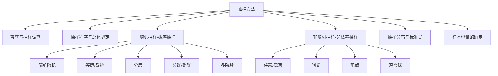

---
tags:
  - 自考/00178
  - 00178/章节/ch06
章节: ch06
章节名: 抽样方法
重要度: 高
状态: 待核实
更新日期: 2026-09-08
---

# ch06 · 抽样方法

> 一句话定位：全卷核心方法章，单选/多选/名解/简答/论述全覆盖，"分层 vs 分群""随机 vs 非随机"是命题人最爱。
> 真题证据：2024-04 论述（普查优缺点）、2023-10 单选11/12（滚雪球、总体要素）、2025-04 简答33（分层注意问题）、2021-04 简答32（配额 vs 分层）+名解（抽样分布）、2025-04 多选25。

## 本章知识框架

## 考点清单

| 考点 | 常考题型 | 频次/重要度 | 掌握要求 |
|---|---|---|---|
| 普查的优缺点 | 论述/简答 | ★★★ | 背诵 |
| 抽样调查的优点 | 简答/单选 | ★★ | 背诵 |
| 界定总体的基本要素 | 单选 | ★★★ | 辨析 |
| 抽样的程序步骤 | 简答 | ★★ | 背诵 |
| 五种随机抽样方法 | 单选/简答 | ★★★ | 理解+辨析 |
| 分层原则与注意问题 | 简答 | ★★★ | 背诵 |
| 四种非随机抽样方法 | 单选 | ★★★ | 辨析 |
| 配额抽样 vs 分层抽样 | 简答 | ★★★ | 辨析 |
| 选择随机/非随机考虑的问题 | 多选 | ★★ | 理解 |
| 抽样分布 | 名解 | ★★★ | 背诵 |
| 标准误与 68.27/95.45/99.73 | 单选/计算 | ★★★ | 记忆 |
| 样本容量公式 | 计算 | ★★★ | 背诵+会算 |

## 核心考点卡（问题 → 采分点）

### Q1. 普查（名解/论述准备）
**答**：普查是对调查对象（总体）的全部单位逐一进行的、全面性的调查。
- 优点（2024-04 论述原题）：①搜集的资料**全面**；②数据比较**准确**；③取得的资料**详尽**、标准化程度高，能为决策提供可靠依据。
- 缺点：①**费用高**（工作量大、耗费人力物力财力多）；②**时间长**（调查周期长，时效性差）；③**组织难度大**（涉及面广，对组织工作要求高，易产生登记性误差）。
- 记忆：**好"全准详"，坏"贵慢难"**。

### Q2. 抽样调查的优点
**答**：从总体中抽取一部分单位进行调查，并以其结果推断总体。
- 采分点：①调查费用低；②速度快、时效性强；③调查范围小、可组织得更精细，准确性有时反而更高；④适用于不可能或不必要普查的场合（如破坏性检验）。

### Q3. 界定总体的基本要素（2023-10 单选12）
**答**：界定总体必须包括四个基本要素——
- ①**抽样元素**（构成总体的最基本单位）
- ②**抽样单位**（抽样时实际抽取的单位）
- ③**抽样范围**（总体的地域/范围界限）
- ④**抽样时间**（总体所属的时间界限）
- ⚠ **"抽样人员"不属于**界定总体的基本要素（2023-10 单选12 正解）。

### Q4. 抽样的程序（步骤）
**答**：①界定总体 → ②确定抽样框架（名单）→ ③选择抽样方法（随机/非随机）→ ④确定样本容量 → ⑤抽取样本 → ⑥评估样本代表性。
- 【待核实：个别教材表述为五步，以教材原文为准】

### Q5. 简单随机抽样
**答**：对总体单位**不作任何分类排队**，按随机原则直接从总体中逐个抽取样本单位，使每个单位被抽中的概率相等。方法：抽签法、随机数表法。适用于总体单位差异小、数量较少的情形。

### Q6. 等距（系统）随机抽样
**答**：先将总体单位按一定标志排队，算出抽样间隔 k=N/n，在第一个间隔内随机确定起点，然后每隔一个间隔抽取一个单位。
- 关键判断：等距抽样**可看成特殊的分层比例抽样**（只从每层中抽一个单位）。【待核实：真题表述"特殊的分层抽样"，以真题为准】

### Q7. 分层随机抽样（2025-04 简答33）
**答**：先将总体按某种特征分成若干层（类型），再从各层中随机抽取样本单位。
- **分层原则**：各层**内部差异小**（同质），层**与层之间差异大**（异质）。
- **分层时应注意的问题**（2025-04 简答33 采分点）：①要选择恰当的、与调查目的有关的分层标志；②分层要清楚，各层界限明确、互不交叉重叠；③各层单位数应可准确掌握；④层数不宜过多，且各层内部应尽可能同质。

### Q8. 分群（整群）随机抽样
**答**：将总体划分为若干群（组），随机抽取**若干群**，对被抽中群内的**所有单位**进行全面调查。
- **特点**：群**内**单位差异**大**（异质）、群**间**差异**小**（同质）——与分层**正好相反**（高频易混！）。

### Q9. 多阶段抽样
**答**：把抽样过程分成两个或两个以上阶段进行：先从总体中抽取大单位，再从中选的单位中抽取较小单位，逐阶段直至抽出最终样本单位。适用于总体范围大、单位分散的调查。

### Q10. 非随机抽样的四种方法
**答**：
- ①**任意（偶遇）抽样**：调查者随意选取遇到的对象，**多用于非正式调查**（正式调查少用）。
- ②**判断抽样**：由专家或调查者凭主观判断选择最有代表性的样本。
- ③**配额抽样**：先将总体分类，**按各类在总体中所占比例分配样本数额**，再由调查者在限额内**任意**抽取。
- ④**滚雪球抽样**：先找少量符合条件的调查对象，再请他们推荐介绍其他对象，样本如滚雪球般扩大；适用于**总体成员难以找到/不易获得名单**的情形（2023-10 单选11）。

### Q11. 配额抽样与分层抽样的联系与区别（2021-04 简答32）
**答**：
- 联系（相同点）：都要事先对总体按一定标志**分层/分类**，并按各类（层）的**比例**确定样本数额。
- 区别：①抽样方式不同——分层抽样在各层内**随机**抽取，配额抽样分配额度后由调查者**任意（非随机）**抽取；②性质不同——分层属**概率（随机）抽样**，能计算抽样误差，配额属**非概率抽样**，不能计算抽样误差。

### Q12. 选择随机抽样与非随机抽样需考虑的问题（2025-04 多选25）
**答**：①研究的性质与目的（探索性/结论性）；②对抽样误差（估计精度）的要求；③总体单位名单（抽样框）的可得性；④调查经费；⑤调查时间；⑥非抽样误差的大小。
- 【待核实：按真题选项校对，多选"错选多选少选均无分"，务必记全】

### Q13. 抽样分布（2021-04 名解）
**答**：从同一总体中抽取容量相同的**一切可能样本**，由这些样本的某一统计量（如样本均值）的取值所形成的**概率分布**，称为该统计量的抽样分布。

### Q14. 均值抽样分布的性质与标准误
**答**：
- 当总体服从正态分布或样本容量足够大（中心极限定理），均值的抽样分布近似正态分布；
- 抽样分布的均值 = 总体均值 μ；
- 抽样分布的标准差（即**标准误**）σ_x̄ = σ/√n；
- 经验法则：样本均值落在总体均值 **±1 个标准误**内的概率约 **68.27%**，**±2 个**约 **95.45%**，**±3 个**约 **99.73%**。
- 记忆："**一六八、二九五四、三九九七三**"（68.27 / 95.45 / 99.73）。

### Q15. 样本容量的确定（计算考点）
**答**（均值估计、重复抽样）：
- 公式：**n = Z²σ² / Δ²**
- 符号说明：n 样本容量；Z 置信度对应的概率度（95% 时 Z=1.96）；σ² 总体方差；Δ 允许误差（极限误差）。
- 记忆提示："**置信平方乘方差，除以误差平方**"。
- 比例估计：**n = Z²p(1-p) / Δ²**；p 未知时取 p=0.5（此时方差最大，样本量最保险）。
- 有限总体校正：n = n₀·N / (N+n₀)，其中 n₀ 为按上式算出的样本量，N 为总体单位数。

## 易错点 / 易混辨析

| 易混组 | 区分要点 |
|---|---|
| 分层 vs 分群 | 分层：**层内差异小、层间差异大**，每层抽部分；分群：**群内差异大、群间差异小**，抽中群全查。口诀"分**层同质选层**，分**群异质选群**" |
| 配额 vs 分层抽样 | 都按比例分类，但分层**层内随机抽**（概率），配额**额度内任意抽**（非概率） |
| 任意 vs 判断抽样 | 任意=碰到谁是谁（偶遇）；判断=凭经验选"有代表性的" |
| 简单随机 vs 等距 | 简单随机不排队纯随机；等距先排队定间隔、只随机定起点 |
| 随机 vs 非随机 | 能否计算抽样误差：随机（概率）可算误差，非随机不能 |
| 等距抽样归类 | 可看成特殊的**分层比例**抽样，不是分群 |

## 真题连线

- 2024-04 论述（普查的优缺点）→ 详见 [[02-历年真题/2024-04]]
- 2023-10 单选11（滚雪球抽样适用情形）→ 详见 [[02-历年真题/2023-10]]
- 2023-10 单选12（界定总体基本要素，"抽样人员"不属）→ 详见 [[02-历年真题/2023-10]]
- 2025-04 简答33（分层抽样注意问题）→ 详见 [[02-历年真题/2025-04]]
- 2025-04 多选25（选择随机/非随机考虑因素）→ 详见 [[02-历年真题/2025-04]]
- 2021-04 简答32（配额与分层抽样的联系区别）→ 详见 [[02-历年真题/2021-04]]
- 2021-04 名词解释（抽样分布）→ 详见 [[02-历年真题/2021-04]]

## 背诵速记

> 普查：好"全准详"、坏"贵慢难"；
> 总体四要素：元素、单位、范围、时间（没有"人员"）；
> 随机五法：简、等、层、群、多阶段；非随机四法：任意、判断、配额、滚雪球；
> 分层"内小间大"，分群"内大间小"；
> 标准误：σ/√n；概率"168-9545-9973"；
> 样本量：n=Z²σ²/Δ²，比例 Z²p(1-p)/Δ²。

## 待核实清单

- [ ] 抽样程序步骤数与教材原文表述对照（页码 __）
- [ ] 等距抽样"特殊的分层比例抽样"与真题原选项表述对照
- [ ] 2025-04 多选25 选项范围核对
- [ ] 标准误经验数据（教材是否用 68.3%/95.5%/99.7% 近似值）
