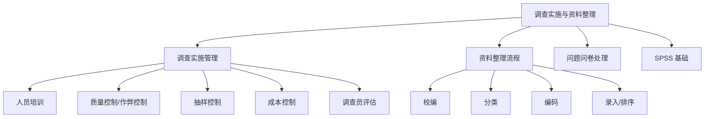

---
tags:
  - 自考/00178
  - 00178/章节/ch07
章节: ch07
章节名: 市场调查实施与资料整理
重要度: 高
状态: 待核实
更新日期: 2026-09-08
---

# ch07 · 市场调查实施与资料整理

> 一句话定位：流程管理章，"调查质量控制""问卷可丢弃情形""资料整理顺序"是单选简答常客。
> 真题证据：2023-04 单选15、2025-04 简答34（评估调查员）、2024-04 单选13+2022-04 多选25（数据分类原则）、2023-10 简答34+2024-10 简答33（可丢弃问卷情形）、SPSS 单选（2021-04、2023-10）。

## 本章知识框架

## 考点清单

| 考点 | 常考题型 | 频次/重要度 | 掌握要求 |
|---|---|---|---|
| 调查人员的培训方法 | 单选/简答 | ★★ | 理解 |
| 调查过程质量控制 | 单选 | ★★★ | 辨析 |
| 作弊控制的情形 | 单选 | ★★★ | 辨析 |
| 抽样控制/成本控制 | 单选 | ★★ | 理解 |
| 评估调查人员 | 单选/简答 | ★★★ | 背诵 |
| 资料整理流程顺序 | 单选 | ★★★ | 记忆 |
| 校编的工作重点 | 简答 | ★★ | 背诵 |
| 数据分类应遵循的原则 | 单选/多选 | ★★★ | 背诵 |
| 可丢弃问卷的情形 | 简答 | ★★★ | 背诵 |
| SPSS File 菜单操作 | 单选 | ★★ | 记忆 |

## 核心考点卡（问题 → 采分点）

### Q1. 调查人员的培训（培训方法）
**答**：培训内容包括调查基本知识、问卷内容、访问技巧、态度礼仪等。
- 培训方法：①书面训练（阅读材料）；②口头讲授（集中授课）；③模拟访问/角色扮演；④现场实习（陪访试访）。
- 【待核实：培训方法的具体分条以教材为准】

### Q2. 调查过程的质量控制（高频辨析）
**答**：对现场调查活动进行监督管理以保证数据质量，主要包括——
- ①**抽样控制**：保证调查员严格按抽样方案选取被调查者，防止随意换人；
- ②**作弊（欺骗）控制**：防止和检查调查员的作弊行为，如**乱填乱答、检查涂改伪造**问卷、编造访谈记录等——属**作弊控制**范畴（单选高频）；
- ③**成本控制**：在保证质量前提下控制调查费用支出；
- ④复核（回访抽查一定比例问卷，核实真实性）。

### Q3. 如何评估市场调查人员（2023-04 单选15 / 2025-04 简答34）
**答**：评估调查员的采分点（分条作答）——
- ①**成本**：比较各调查员的费用支出（平均每份问卷成本）；
- ②**时间**：完成调查的速度/工时效率；
- ③**回答率**（回收率、合作率）：取得有效问卷的比率；
- ④**访谈质量**：访问过程是否规范、态度是否得当；
- ⑤**数据质量**：问卷填写是否完整、准确、清晰（错答漏答率）。
- 记忆：**"成本、时间、回答率，访谈、数据两质量"**。

### Q4. 资料整理的基本流程（顺序为考点）
**答**：**校编（编辑）→ 分类 → 编码 → 录入（排序）**。
- 校编：对问卷进行检查、校订，发现问题及时补救；
- 分类：按标志把资料归入不同类别；
- 编码：给问题和答案赋予数字代码，便于计算机处理；
- 录入：把编码后的数据输入计算机（排序/汇总）。
- ⚠ "**先分类再校编**"是**错误**说法——必须先校编后分类（单选陷阱）。

### Q5. 校编的工作重点
**答**：①检查问卷的**完整性**（有无漏答、缺页）；②检查答案的**准确性**（有无明显错误、逻辑矛盾）；③检查**可理解性/清晰度**（字迹、表述是否清楚可辨）；④检查**一致性**（前后答案是否矛盾）。
- 【待核实：与教材分条表述对照】

### Q6. 数据分类应遵循的原则（2024-04 单选13 / 2022-04 多选25）
**答**：教材列六原则——**适当性、包容性（穷尽性）、互斥性、差异性、单一性、全面性**。核心辨析三条：
- ①**互斥性**：各类别之间**不重叠**，**每种答案只能归入一种类别**（2017-10 单选12 答案 D、2021-10 单选15 答案 B）；
- ②**单一性**：**分类的基础（标志）只能有一种**，不能同时用两种分类标准（2019-04 单选14 答案 B、2024-04 单选13）；
- ③**包容性（穷尽性）**：分类要穷尽所有可能，使每种答案都有类可归（必要时设"其他"类）。
- 口诀："**互斥归一类，单一一标准，穷尽皆有属**"。

### Q7. 不符合要求的问卷可丢弃的情形（2023-10 简答34 / 2024-10 简答33）
**答**：不符合要求的问卷可作丢弃处理的情形——
- ①不符合要求的问卷占问卷总数的比例**很小（10% 以下）**；
- ②调查的**样本容量很大**，丢弃后仍能满足分析需要；
- ③问题问卷的缺陷不涉及关键问题（关键项目完整的问卷仍可保留）【待核实】；
- ④被调查者明显不认真作答、大面积漏答、规律性作答（通篇同一答案）等无法补救的问卷【待核实】。
- 记忆要点：抓"**10% 以下 + 样本量大**"两个硬条件。

### Q8. SPSS 基础操作（2021-04、2023-10 单选）
**答**：
- 在 SPSS 中，**File（文件）菜单**用于**调入（打开）数据文件和保存文件**（Open / Save）；
- 数据编辑在 Data View（数据视图），变量定义在 Variable View（变量视图）；
- 统计分析功能集中在 **Analyze（分析）菜单**。
- 单选常考："调入/保存文件用 File 菜单"。

## 易错点 / 易混辨析

| 易混组 | 区分要点 |
|---|---|
| 校编 vs 分类顺序 | 先**校编**后**分类**："先编辑整理、再归类" |
| 质量控制 vs 作弊控制 | 作弊控制（乱填乱答、涂改伪造）是质量控制中针对调查员欺骗行为的部分 |
| 互斥性 vs 单一性 | **互斥性**＝一种答案只归一类（类别不重叠）；**单一性**＝分类基础只能有一种（分类标志唯一） |
| 问卷丢弃 vs 补救 | 能电话回访/逻辑修正的先补救；满足"10%以下+样本量大"才可丢弃 |
| SPSS 菜单 | File=文件调入保存；Analyze=统计分析；勿混 |
| 编码 vs 分类 | 分类=按标志分门别类（概念归类）；编码=给每类答案配数字代号（便于机器录入） |
| 有效性 vs 可靠性 | 质量控制的落脚点：抽到的真按要求抽（抽样控制）、答的是真实结果（作弊控制） |
| 可丢弃 vs 可补救 | 满足"10%以下+样本量大"才弃；能回访修正/关键项目完整的应保留 |

## 真题连线

- 2023-04 单选15（评估调查人员）→ 详见 [[02-历年真题/2023-04]]
- 2025-04 简答34（如何评估市场调查人员）→ 详见 [[02-历年真题/2025-04]]
- 2024-04 单选13（数据分类原则——单一性=分类基础唯一）→ 详见 [[02-历年真题/2024-04]]
- 2022-04 多选25（数据分类原则）→ 详见 [[02-历年真题/2022-04]]
- 2023-10 简答34（可丢弃问卷的情形）→ 详见 [[02-历年真题/2023-10]]
- 2024-10 简答33（可丢弃问卷的情形）→ 详见 [[02-历年真题/2024-10]]
- 2021-04 单选（SPSS File 菜单）→ 详见 [[02-历年真题/2021-04]]
- 2023-10 单选（SPSS File 菜单）→ 详见 [[02-历年真题/2023-10]]

## 背诵速记

> 整理四步："**校—分—编—录**"（校编→分类→编码→录入）；
> 分类两原则："**互斥、穷尽**"；
> 评估调查员："**成本时间回答率，访谈数据两质量**"；
> 校编重点：查**完整、查准确、查清晰、查一致**；
> 问卷可丢弃："**一成以下、样本够大**"；
> 作弊控制：乱填乱答、涂改伪造；SPSS 文件操作找 File。
> 录入完成后作排序/汇总，为下一步统计分析做准备。
> 两阶段分工：实施阶段保"真"，整理阶段保"净"（纠错、归类、编码、录入）。

## 待核实清单

- [ ] 培训方法分条与教材原文对照（页码 __）
- [ ] 校编工作重点分条与教材原文对照
- [ ] 可丢弃问卷情形第③④条表述与教材/真题标准答案核对
- [ ] 调查过程质量控制的完整分条（是否含"复核"独立条目）
- [ ] SPSS 具体版本下 File 菜单调入/保存步骤与教材核对
- [ ] "录入后排序"环节是否另有"汇总/制表"称谓
