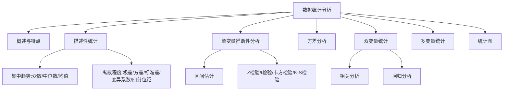

---
tags:
  - 自考/00178
  - 00178/章节/ch08
章节: ch08
章节名: 市场调查数据统计分析
重要度: 高
状态: 待核实
更新日期: 2026-09-08
---

# ch08 · 市场调查数据统计分析

> 一句话定位：计算+辨析双料大章，集中趋势三指标、离散指标、假设检验步骤、方差分析、相关回归是必考核心。
> 真题证据：2023-10 简答35（统计分析特点）、2025-04 单选16（三者关系）、2023-10 名解（方差）、2022-04/2025-04 单选17（变异系数）、2025-04 计算37+2026-04 名解28（四分位点内距）、2025-04 简答35（假设检验步骤）、2022-10 单选16、2024-04 单选15/20、2022-10/2023-10 单选20。

## 本章知识框架

## 考点清单

| 考点 | 常考题型 | 频次/重要度 | 掌握要求 |
|---|---|---|---|
| 统计分析的特点 | 简答 | ★★★ | 背诵 |
| 众数/中位数/算术平均数 | 单选/计算 | ★★★ | 理解+会算 |
| 三者关系（偏态中位置） | 单选 | ★★★ | 辨析 |
| 方差 | 名解/计算 | ★★★ | 背诵+会算 |
| 标准差、极差 | 计算 | ★★ | 会算 |
| 变异系数 | 单选/计算 | ★★★ | 背诵 |
| 四分位点内距 | 名解/计算 | ★★★ | 背诵+会算 |
| 频率 | 名解 | ★★ | 背诵 |
| 区间估计公式 | 计算 | ★★★ | 背诵+会算 |
| 假设检验基本步骤 | 简答 | ★★★ | 背诵 |
| 四种检验的适用 | 单选 | ★★ | 理解 |
| 方差分析 | 单选 | ★★★ | 理解 |
| 相关 vs 回归 | 单选 | ★★★ | 辨析 |
| 多元回归对变量要求 | 单选 | ★★ | 记忆 |
| 统计图的选择 | 单选 | ★★★ | 辨析 |

## 核心考点卡（问题 → 采分点）

### Q1. 市场调查数据统计分析的特点（2023-10 简答35）
**答**：统计分析是对调查数据运用统计方法进行加工、推断的过程。其特点——
- ①数量性：以数据为基础，研究事物的数量方面；
- ②总体性：从总体（样本代表总体）角度揭示规律，而非个别现象；
- ③具体性：结论是针对具体时间、地点、条件下的客观实际；
- ④方法多样性/推断性：由已知样本推断总体特征，具有推断性质。
- 【待核实：请按教材标准表述逐条核对，首句即采分点】

### Q2. 集中趋势三指标（必算必辨）
**答**：
- **众数**：数据中出现**次数最多**的数值；一个分布**不一定有唯一众数**（可无、可多个）。
- **中位数**：将数据按大小**排序**后处于**中间位置**的数值；奇数个数据取最中间那个，偶数个数据取中间两个的**平均数**。
- **算术平均数（均值）**：所有数值总和除以个数，x̄ = Σxᵢ/n；受**极端值**影响大。

### Q3. 众数、中位数、均值三者的关系（2025-04 单选16"说法错误"）
**答**：
- 分布完全对称时：三者**相等**（众数=中位数=均值）；
- 右偏（正偏，有大极端值）：均值 > 中位数 > 众数；
- 左偏（负偏，有小极端值）：均值 < 中位数 < 众数；
- 三者关系体现分布的偏态方向；中位数始终居中，众数不变、均值最易被拉向长尾一端。
- ⚠ 做单选时盯住"**对称→三者相等**""**均值受极端值影响最大**"两个判据点。

### Q4. 方差（2023-10 名解）
**答**：各变量值与其算术平均数**离差平方的平均数**，反映数据的离散（变异）程度。
- 公式（样本）：**s² = Σ(xᵢ - x̄)² / (n-1)**
- 符号说明：s² 样本方差；xᵢ 各观测值；x̄ 样本均值；n 样本容量（样本方差分母用 n-1）。
- 记忆提示："**离差平方的平均**"。

### Q5. 离散程度指标一组（会算）
**答**：
- **极差**：最大值 - 最小值，最简单但易受极端值影响；
- **方差**：见 Q4；
- **标准差**：方差的算术平方根，s = √s²，与原数据同计量单位；
- **变异系数**：**CV = 标准差 / 均值（s/x̄）**——相对离散程度指标，用于比较**不同水平、不同计量单位**数据的离散程度（2022-04、2025-04 单选17）。
- 记忆提示：变异系数="**差比均，无量纲，好比较**"。

### Q6. 四分位点内距（2025-04 计算37 / 2026-04 名解28）
**答**：排序后第 3 四分位数（Q3，75% 位置）与第 1 四分位数（Q1，25% 位置）之差。
- 公式：**四分位点内距 = Q3 - Q1**
- 符号说明：Q3 上四分位数（以下有 75% 数据）；Q1 下四分位数（以下有 25% 数据）。
- 意义：反映中间 50% 数据的离散程度，不受极端值影响。
- 记忆提示："**上减下，七五减二五**"。

### Q7. 频率（2021-04 名解）
**答**：各组（类）出现的次数（频数）与总次数的比值，反映各组在总体中所占的比重，各组频率之和等于 1（100%）。

### Q8. 区间估计（计算）
**答**：用样本均值估计总体均值所在的范围（置信区间）。
- 公式：**置信区间 = x̄ ± Z·s/√n**
- 符号说明：x̄ 样本均值；Z 置信度的概率度（95% 时 1.96）；s 样本标准差；n 样本容量；s/√n 即标准误。
- 记忆提示："**均值加减概率度乘标准误**"。

### Q9. 假设检验的基本步骤（2025-04 简答35）
**答**：
- ①**提出原假设 H₀ 与备择假设 H₁**；
- ②**选择适当的检验统计量**（Z、t、χ² 等）并确定其分布；
- ③**确定显著性水平 α**（如 0.05），划分拒绝域与接受域；
- ④根据样本计算统计量值，与临界值比较，**作出接受或拒绝 H₀ 的决策**。
- 口诀："**提假设、选统计量、定显著性、作决策**"。

### Q10. 四种常用检验的适用（单选辨析）
**答**：
- **Z 检验**：总体方差已知或大样本（n≥30）的均值检验；
- **t 检验**：总体方差未知且**小样本**的均值检验；
- **卡方检验（χ²）**：**计数资料**的独立性检验、拟合优度检验；
- **K-S 检验**：检验样本分布与某一理论分布是否一致的拟合优度检验。

### Q11. 方差分析（2022-10 单选16）
**答**：方差分析（单因素）用于**检验多个总体均值是否相等**（≥3 组），又称 **F 检验**（单选："方差分析也称 F 检验"）。基本思想：把总变异分解为组间变异与组内变异，比较二者大小。

### Q12. 相关分析与回归分析（2024-04 单选15）
**答**：
- **相关分析（简单相关）**：研究**两个变量**之间相关关系的密切程度与方向（用相关系数 r 表示）；
- **回归分析**：确定**两个或两个以上变量**之间相互依赖的**定量关系**，用回归方程由一个（些）变量估计预测另一变量。
- ⚠ 题干出现"两变量**以上**、定量关系"→ 选回归分析。

### Q13. 多元回归的变量要求（2023-04 单选16）
**答**：多元回归分析中，**因变量（被解释变量）必须是等差（定距）或等比（定比）量表**测量的变量；定类、定序变量不能直接作多元回归的因变量。

### Q14. 常用统计图的选择（单选高频）
**答**：
- **饼形图**：表示**部分与整体的关系**、各部分占整体的**数量比例**（2022-10、2023-10 单选20）；
- **曲线图（折线图）**：表示**现象随时间变动**的趋势（2024-04 单选20）；
- 柱（条）形图：比较各类别数量大小。
- 口诀："**饼比部分、线看时间、柱比大小**"。

## 易错点 / 易混辨析

| 易混组 | 区分要点 |
|---|---|
| 众数 vs 中位数 | 众数=出现**最多**（可无/可多）；中位数=排序后**位置居中**（不受极端值影响） |
| 三者关系 | 对称时相等；右偏：均值>中位数>众数；左偏相反 |
| 标准差 vs 变异系数 | 标准差有单位、看绝对离散；变异系数=标准差/均值、无量纲、比相对离散 |
| 四分位距 vs 极差 | 极差=最大-最小（两端）；四分位距=Q3-Q1（中间50%，抗极端值） |
| Z 检验 vs t 检验 | 大样本/方差已知用 Z；小样本+方差未知用 t |
| 相关 vs 回归 | 相关：2 变量、测密切程度；回归：≥2 变量、求定量依赖关系、可预测 |
| 饼图 vs 曲线图 | 部分占整体→饼；随时间变动→曲线 |

## 真题连线

- 2023-10 简答35（数据统计分析的特点）→ 详见 [[02-历年真题/2023-10]]
- 2025-04 单选16（三者关系说法错误）→ 详见 [[02-历年真题/2025-04]]
- 2023-10 名词解释（方差）→ 详见 [[02-历年真题/2023-10]]
- 2022-04 / 2025-04 单选17（变异系数）→ 详见 [[02-历年真题/2022-04]] / [[02-历年真题/2025-04]]
- 2025-04 计算37（四分位点内距）→ 详见 [[02-历年真题/2025-04]]
- 2026-04 名解28（四分位点内距）→ 详见 [[02-历年真题/2026-04]]
- 2025-04 简答35（假设检验基本步骤）→ 详见 [[02-历年真题/2025-04]]
- 2022-10 单选16（方差分析也称）→ 详见 [[02-历年真题/2022-10]]
- 2024-04 单选15（回归分析）→ 详见 [[02-历年真题/2024-04]]
- 2023-04 单选16（多元回归因变量要求）→ 详见 [[02-历年真题/2023-04]]
- 2021-04 名词解释（频率）→ 详见 [[02-历年真题/2021-04]]
- 2022-10 / 2023-10 单选20（饼形图）→ 详见 [[02-历年真题/2022-10]] / [[02-历年真题/2023-10]]
- 2024-04 单选20（曲线图）→ 详见 [[02-历年真题/2024-04]]

## 背诵速记

> 三集中：众数最多、中位居中、均值怕极端；
> 四离散："极差方差标准差，变异系数比两下（差/均）"；
> 四分位距"上减下（Q3-Q1）"；
> 置信区间"均值 ± Z×s/√n"；
> 检验步骤："提假设、选统计量、定显著、作决策"；
> 卡方计数、K-S 拟合、Z 大样本、t 小样本；
> 方差分析 = F 检验 = 多个均值是否相等；
> 两变量看相关、两变量以上看回归；饼比部分、曲线看时间。

## 待核实清单

- [ ] 统计分析特点的教材原文分条（页码 __）
- [ ] 中位数偶数个数据的教材处理（是否含插值法）
- [ ] 样本方差分母 n-1 与教材是否一致（教材或按 n）
- [ ] Z/t 临界样本量（教材是否用 30 划分）
