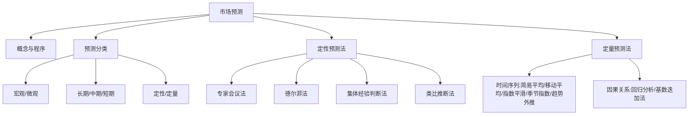

---
tags:
  - 自考/00178
  - 00178/章节/ch09
章节: ch09
章节名: 市场预测方法
重要度: 高
状态: 待核实
更新日期: 2026-09-08
---

# ch09 · 市场预测方法

> 一句话定位：全书压轴大章，名解、简答、论述、计算全题型高发区，"德尔菲法"与"时间序列计算"是必须拿下的两大山头。
> 真题证据：2023-04 名解+简答34（市场预测及程序）、2026-04 名解（宏观市场预测）、2025-04 论述36（德尔菲法）、2021-04 名解（专家会议法）、2023-04 单选17/18、2022-04 简答32/35、2023-10 名解（类比推断）+多选24、2023-04 计算38、2022-10 计算38、2024-04 单选17+简答35、2024-10 单选18+计算38。

## 本章知识框架

## 考点清单

| 考点 | 常考题型 | 频次/重要度 | 掌握要求 |
|---|---|---|---|
| 市场预测（名解） | 名解 | ★★★ | 背诵 |
| 市场预测程序 | 简答 | ★★★ | 背诵 |
| 预测分类（宏观/微观、长中短期、定性定量） | 名解/单选 | ★★★ | 辨析 |
| 市场行情预测 | 单选 | ★★ | 记忆 |
| 专家会议法 | 名解 | ★★★ | 背诵 |
| 德尔菲法特征与使用 | 单选/论述 | ★★★ | 背诵+展开 |
| 集体经验判断法步骤 | 简答 | ★★★ | 背诵 |
| 类比推断法 | 名解 | ★★ | 背诵 |
| 简易平均法（算术/加权/几何） | 单选/计算 | ★★★ | 会算 |
| 移动平均（含加权移动平均） | 计算 | ★★★ | 会算 |
| 一次指数平滑 | 计算 | ★★★ | 会算 |
| 二次移动平均、季节指数法、趋势外推 | 计算 | ★★ | 会算 |
| 回归分析步骤 | 简答 | ★★★ | 背诵 |
| 回归与相关的关系 | 多选 | ★★ | 辨析 |
| 基数迭加法 | 单选/计算 | ★★ | 理解 |
| 定性预测优缺点、定量预测优点 | 简答/单选 | ★★★ | 背诵 |

## 核心考点卡（问题 → 采分点）

### Q1. 市场预测（2023-04 名解）
**答**：市场预测是在市场调查的基础上，运用科学的方法和手段，对市场未来的发展趋势、变化规律及前景所作的分析、估计和推测。

### Q2. 市场预测的程序（2023-04 简答34）
**答**：①确定预测目标；②收集、整理预测所需资料；③选择预测方法；④建立预测模型并进行预测（测算）；⑤分析预测误差、评价预测结果；⑥提出预测报告。
- 口诀："**定目标—收资料—选方法—作预测—评误差—出报告**"。

### Q3. 预测的分类（辨析高频）
**答**：
- 按范围：**宏观市场预测**（2026-04 名解：对整个国民经济、全行业、整个市场的总体发展方向和趋势所作的预测）vs **微观市场预测**（企业对其自身经营的产品/局部市场的预测）；
- 按期限：**长期**（**五年以上**）、**中期**（**一年以上五年以内**）、**短期**（**一年以内**）——三个数字卡点必记；
- 按性质/方法：**定性预测**（凭经验知识判断）vs **定量预测**（用数据和数学模型计算）——判断依据：是否建立数学模型、以数量计算为主。

### Q4. 市场行情预测（2023-04 单选18）
**答**：对**市场形势的运行状态**（供求关系、价格变动、景气状况等）所作的**分析预测**，属短期、动态性预测。

### Q5. 专家会议法（2021-04 名解）
**答**：邀请有关方面的**专家**通过**召开会议**的形式，对预测对象的发展趋势进行分析、判断，综合专家们的集体意见作出预测的方法。

### Q6. 德尔菲法（专家小组法）——特征与使用（2023-04 单选17、2025-04 论述36）
**答（特征）**：①**匿名性**——专家之间互不见面、互不知晓，"背靠背"发表意见；②**反馈性**——多轮函询，每轮统计结果反馈给专家供其修正意见；③**统计性**——用**统计方法**对专家意见进行整理、归纳得出预测结论。
- ⚠ "**经济性**"**不是**德尔菲法的（独有）特征——2023-04 单选17。
- **答（如何使用，论述36 分条）**：①**选定专家**：聘请**10~15 名**（人数左右）与预测问题有关的专家；②**函询（背靠背）**：向专家寄发调查表，专家匿名独立作答；③**轮番反馈**：将每轮结果汇总统计后反馈，请专家修正，反复数轮；④**统计收敛**：意见趋于集中时用统计方法整理，得出预测结论。
- 口诀："**匿名、反馈、统计；选专家、函询问、轮反馈、统收敛**"。

### Q7. 集体经验判断法（集合意见法）的基本步骤（2022-04 简答32）
**答**：①选定若干名熟悉情况的业内人士表示意见；②每人提出自己的预测方案（含期望值估计）；③计算各人方案的预期值；④按一定权数对参与者的方案进行加权综合；⑤得出集体的综合预测值。
- 【待核实：与教材分条表述逐字对照】

### Q8. 类比推断法（2023-10 名解）
**答**：根据**相似性原理**，以与预测对象相类似的已知事物（先导事件）的发展变化规律为依据，推断预测对象未来发展趋势的定性预测方法。

### Q9. 简易平均法（单选：算术平均法属于简易平均法）
**答**：以历史数据的平均数作为下期预测值，包括——
- ①**算术平均法**：x̄ = Σxᵢ/n，各期同等重要；
- ②**加权平均法**：x̄w = Σwᵢxᵢ/Σwᵢ；**权数原则：越接近预测期（近期）的数据，权数越大**；
- ③**几何平均法**：以各期环比发展速度（比率）的几何平均数推算，适用于发展速度大致稳定的情形。

### Q10. 移动平均法（计算高频）
**答**：逐期移动，用最近 N 期数据的平均数作为下一期预测值。
- 简单移动平均：M̂t+1 = (xt-N+1 + … + xt)/N；
- **加权移动平均**：**M̂t+1 = Σwᵢxᵢ / Σwᵢ**，如三期、权数 1,2,3：**M̂t+1 = (1·xt-2 + 2·xt-1 + 3·xt) / 6**；
- 符号说明：xt 第 t 期实际值；wᵢ 权数（越近越大）；分母为权数之和。
- 记忆提示："**近大远小加权，权数之和作分母**"。
- 【示例（自编，非真题）】近三期销售额 100、120、140，权数 1、2、3：M̂ = (1×100+2×120+3×140)/6 = 760/6 ≈ 126.7。

### Q11. 指数平滑法（一次指数平滑，计算必会）
**答**：
- 公式：**本期预测值 Ŷt+1 = α·Xt + (1-α)·Ŷt**（教材表述："本期预测值=α·本期实际值+(1-α)·上期预测值"，即α 乘以**本期实际**、(1-α) 乘以**上期预测**）
- 符号说明：α 平滑系数（0<α<1）；Xt 本期实际值；Ŷt 上期（对本期所作）预测值。
- 记忆提示："**平滑常数乘实际，一加余数乘预测**"——α 与 1-α 配对实际与预测。
- 【示例（自编，非真题）】α=0.3，本期实际 100，上期预测 90：Ŷ = 0.3×100+0.7×90 = 93。

### Q12. 二次移动平均、季节指数法、趋势外推（计算题型）
**答**：
- **二次移动平均**：适用于**线性趋势**数据，对一次移动平均值再作一次移动平均，求截距 a、斜率 b 后建立趋势方程 Ŷt+T = at + bt·T（2023-04 计算38 题型）；
- **季节指数法**：先求各年同季（月）平均与总平均，季节指数=同季平均/总平均，用季节指数调整预测（2022-10 计算38 题型）；
- **趋势外推法**：依历史数据拟合趋势方程（直线/曲线），向外延伸预测未来。

### Q13. 回归分析的基本步骤（2022-04 简答35 / 2026-04 简答34）
**答**：①分析变量间关系，确定自变量与因变量，选定回归模型；②收集数据，估算回归方程参数（建立 ŷ = a+bx）；③对回归方程和参数进行检验（显著性检验）；④用方程进行预测（并评价预测精度）。
- 口诀："**定变量—估参数—作检验—去预测**"。

### Q14. 回归分析与相关分析的关系（2023-10 多选24）
**答**：①**联系**：相关分析是回归分析的基础和前提，相关程度越高，回归预测越可靠；②**区别**：相关分析测度变量间相关的方向与密切程度，不分主从；回归分析确定变量间**定量依赖的数量关系**，区分自变量与因变量，可用于预测。
- 【待核实：按真题选项逐条核对】

### Q15. 基数迭加法（2024-04 单选17 / 2024-10 计算38）
**答**：**属因果关系分析预测法**——以基期（上期）实际数为基数，分析预测期各**影响因素的变化量（增减幅度）**，逐项迭加（修正）得出预测值：Ŷ = 基数 × (1+各因素影响百分比之和) 或 基数 ± 各因素增减量。
- 记忆：看到"在……基础上考虑各因素增减"→ 基数迭加法 → 因果预测。

### Q16. 定性预测法的优缺点（2024-04 简答35 考缺点）
**答**：
- 优点：①简便易行、灵活；②能利用专家经验知识；③在资料缺乏、难以量化时仍可进行。
- **缺点（采分点）**：①**主观性强**，易受个人经验、能力、偏好影响；②**缺乏精确的定量分析**，预测结果不够精确；③易受心理从众、权威意见等干扰，结果**难以验证/可比性差**。

### Q17. 定量预测法的优点（2024-10 单选18）
**答**：建立在数据与数学模型基础上，结果**客观、精确、可检验/可重复**，能作误差分析，人为干扰小。
- ⚠ 反向排除：定性预测优点"灵活、凭经验"不是定量预测优点。

## 易错点 / 易混辨析

| 易混组 | 区分要点 |
|---|---|
| 宏观 vs 微观预测 | 宏观=全社会/全行业总趋势；微观=某企业/局部市场 |
| 长/中/短期 | 长期>5年；中期1~5年；短期<1年，记"**一五为界**" |
| 专家会议 vs 德尔菲 | 会议法=面对面开会（易受权威影响）；德尔菲=匿名函询、多轮反馈、统计整理 |
| 德尔菲三特征 | **匿名、反馈、统计**；"经济性"不属于 |
| 简易平均 vs 移动平均 | 简易平均用全部历史平均；移动平均只用最近 N 期、逐期滑动 |
| 加权平均/加权移动平均 | 共同原则：**越接近预测期权数越大** |
| 一次指数平滑 | α 配"本期实际"、(1-α) 配"上期预测" |
| 相关 vs 回归 | 相关测密切程度不分主从；回归分自变量因变量、可预测 |
| 时间序列 vs 因果预测 | 按时间自身延伸=时序；基数迭加、回归=因果 |
| 定性 vs 定量优缺点 | 定性"快而主观、不精确"；定量"客观精确、可检验" |

## 真题连线

- 2023-04 名词解释（市场预测）/ 简答34（预测程序）→ 详见 [[02-历年真题/2023-04]]
- 2026-04 名词解释（宏观市场预测）→ 详见 [[02-历年真题/2026-04]]
- 2023-04 单选17（德尔菲法特征）/ 单选18（市场行情预测）→ 详见 [[02-历年真题/2023-04]]
- 2025-04 论述36（如何使用德尔菲法）→ 详见 [[02-历年真题/2025-04]]
- 2021-04 名词解释（专家会议法）→ 详见 [[02-历年真题/2021-04]]
- 2022-04 简答32（集体经验判断法步骤）/ 简答35（回归分析步骤）→ 详见 [[02-历年真题/2022-04]]
- 2026-04 简答34（回归分析基本步骤）→ 详见 [[02-历年真题/2026-04]]
- 2023-10 名词解释（类比推断法）/ 多选24（回归与相关关系）→ 详见 [[02-历年真题/2023-10]]
- 2023-04 计算38（二次移动平均）→ 详见 [[02-历年真题/2023-04]]
- 2022-10 计算38（季节指数法）→ 详见 [[02-历年真题/2022-10]]
- 2024-04 单选17（基数迭加法）/ 简答35（定性预测缺点）→ 详见 [[02-历年真题/2024-04]]
- 2024-10 单选18（定量预测优点）/ 计算38（基数迭加）→ 详见 [[02-历年真题/2024-10]]

## 背诵速记

> 预测程序：定目标、收资料、选方法、作预测、评误差、出报告；
> 期限："一五为界"——短<1年、中1-5年、长>5年；
> 德尔菲："匿名、反馈、统计" + "选专家10-15、函询背靠背、轮番反馈、统计收敛"；"经济性"不入选；
> 加权原则"越近越大"；
> 加权移动平均：M̂=(1·xt-2+2·xt-1+3·xt)/6；
> 指数平滑：预测=α×实际+(1-α)×上预测；
> 回归四步：定变量、估参数、作检验、去预测；
> 定性缺点：主观、不精确、难验证。

## 待核实清单

- [ ] 德尔菲法专家人数"10-15 人"与教材表述核对（页码 __）
- [ ] 集体经验判断法步骤与教材分条逐字核对
- [ ] 市场预测程序各步骤与教材表述核对
- [ ] 指数平滑公式下标约定（Ŷt+1 vs Ŷt）与教材核对
- [ ] 基数迭加法计算式与 2024-10 计算38 真题数据核对
