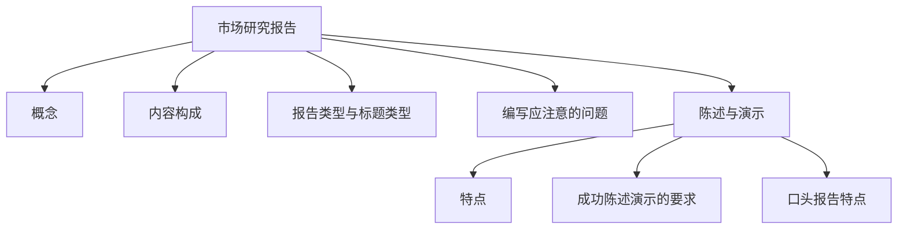

---
tags:
  - 自考/00178
  - 00178/章节/ch10
章节: ch10
章节名: 市场研究报告的编写与陈述
重要度: 中
状态: 待核实
更新日期: 2026-09-08
---

# ch10 · 市场研究报告的编写与陈述

> 一句话定位：收官应用章，名解"市场研究报告"+ 简答"报告构成/陈述特点" + 单选标题辨析，背诵为主、分值好拿。
> 真题证据：2023-04 名解（市场研究报告）+ 简答35（内容构成）+ 单选19（直叙式标题）+ 单选20（编写注意）、2022-04 简答34（陈述与演示特点）、2023-10 论述36（如何成功陈述演示）、2021-04 简答35（口头报告特点）、2024-04 单选19（分析建议问题）、2024-10 单选20（标题类型）。

## 本章知识框架

## 考点清单

| 考点 | 常考题型 | 频次/重要度 | 掌握要求 |
|---|---|---|---|
| 市场研究报告（名解） | 名解 | ★★★ | 背诵 |
| 研究报告的内容构成 | 简答 | ★★★ | 背诵 |
| 报告类型与标题类型 | 单选 | ★★★ | 辨析 |
| 编写应注意的问题 | 单选/简答 | ★★★ | 背诵 |
| 常用统计图 | 单选 | ★★ | 理解 |
| 陈述与演示的特点 | 简答 | ★★★ | 背诵 |
| 如何成功陈述演示 | 论述 | ★★★ | 背诵+展开 |
| 口头报告的特点 | 简答 | ★★ | 背诵 |
| 报告内容"必须有/不必有"辨析 | 单选 | ★★ | 理解 |

## 核心考点卡（问题 → 采分点）

### Q1. 市场研究报告（2023-04 名解）
**答**：市场调查报告（研究报告）是将调查分析过程中形成的结论，**以文字和图表等形式加以整理并形成的书面报告**；它是市场调查活动的**最终成果/具体体现**，供决策者作为参考依据。
- 采分点：①调查分析结论 ②文字图表形式整理 ③书面报告 ④调查成果、供决策参考。
- 【待核实：与教材定义措辞逐字对照】

### Q2. 研究报告的内容构成（2023-04 简答35）
**答**：一份完整的市场研究报告通常包括——
- ①**题目页/标题**（报告名称）；
- ②**目录**；
- ③**概要（摘要/提要）**：简明概述调查对象、方法与主要结论建议；
- ④**正文**：引言（调查背景与目的）、调查过程与方法、调查结果、**分析与建议**、结论；
- ⑤**附录**（调查问卷、原始数据、参考文献等）。
- 【待核实：教材分条命名与顺序逐字核对】

### Q3. 报告的类型与标题类型（2023-04 单选19 / 2024-10 单选20）
**答**：
- 报告类型（按内容性质）：综合性/专题性报告等【待核实：教材分类口径】；
- **标题类型**（高频单选）：判断给定标题属于哪种——
  - **直叙式标题**：直接写明调查内容/对象/范围，如"关于新能源（汽车）市场状况的调查报告"（2024-10 单选20）；
  - 表明观点式、提问式标题等其他类型【待核实：教材其余标题类型名称】。
- 口诀："**直叙=直接点明调查对象内容**"。

### Q4. 编写研究报告应注意的问题（2023-04 单选20"不包括经济性"）
**答**：应注意的问题包括——
- ①**真实性**：如实反映调查结果，不主观臆断；
- ②**针对性**：围绕调查目的与读者（决策者）需要来写；
- ③**时效（及时）性**：报告要及时，过时的信息价值大打折扣；
- ④应注意的表述要求：层次清楚、文字简洁、图表配合得当。
- ⚠ **"经济性"不属于**编写报告应注意的问题（2023-04 单选20 正解）。

### Q5. 常用统计图（结合 ch08）
**答**：报告常用图形：柱（条）形图——比较数量大小；饼形图——部分与整体的比例关系；曲线（折线）图——现象随时间的变动趋势。选择依据：表达目的与数据性质。

### Q6. 陈述与演示的特点（2022-04 简答34）
**答**：口头陈述与演示是调查成果向管理者的**口头沟通环节**，其特点——
- ①**视听结合**：借助幻灯片、图表等视听教具，直观高效传递信息；
- ②**双向（交互）沟通**：现场提问答疑，沟通更充分；
- ③**灵活性强**：可根据听众反应随时调整内容与节奏；
- ④**综合性**：将报告要点浓缩为简明阐释，突出主要发现与建议。
- 【待核实：各特点与教材学名表述对照】

### Q7. 如何成功地进行陈述与演示（2023-10 论述36）
**答**（论述题展开）：
- ①**充分了解与分析听众**：掌握听众（管理者）的背景、需求与关注重点，站在其角度组织内容；
- ②**精心准备陈述材料**：准备口头报告大纲、演示文稿与视听教具，内容取舍突出**主要调查结果与建议**；
- ③**熟悉内容、反复演练**：不照本宣科，语音、语速、语调得当，把握时间；
- ④**有效利用视听手段**：图表化呈现数据，文字精炼、画面简洁；
- ⑤**掌握现场沟通技巧**：开场吸引注意、眼神交流、控制进度、回答与处理提问；
- ⑥**陈述后做好衔接**：提供书面报告供决策参考。
- 【待核实：论述采分点与教材/答案的对应关系】

### Q8. 口头报告（口头陈述）的特点（2021-04 简答35）
**答**：相对于书面报告，口头报告——
- ①简便灵活、能**即时**进行；
- ②可进行**双向沟通**：当面提问、解答与讨论（互动性）；
- ③可结合图示、影像作生动表达，印象深刻；
- ④但其**保留时间短**，需与书面报告配合使用。

### Q9. 分析与建议问题（2024-04 单选19）
**答**：正文的基本要求——
- **分析**部分：基于调查数据得出结论，是报告主体、**必须出现**；
- **建议**：属于报告撰写人的**主观性提议**，**不属于报告中必须出现的内容**（2024-04 单选19 正解）——报告必须基于客观调查事实，而建议可写可不写。
- ⚠ 与"分析与建议部分（结构组成里会提到）"区分：问"必须出现"选"建议"。

## 易错点 / 易混辨析

| 易混组 | 区分要点 |
|---|---|
| 标题类型 | 直叙式=直接写调查对象内容（有"关于…的报告"字样）；无论据即可判断观点式/提问式等另当别类 |
| 编写注意问题 | 有"真实性、针对性、时效（及时）性"等；**经济性×**（2023-04 单选） |
| 必须内容 vs 建议 | 报告必须基于客观事实的分析结论；"建议"属主观提议、**不必出现** |
| 书面 vs 口头报告 | 书面：规范完整、可查存；口头：即时、双向互动、生动，但留存短 |
| 概要 vs 正文 | 概要=浓缩结论建议供快速决策；正文=完整过程、数据与论据 |
| 统计图再辨析 | 部分占整体→饼；随时间变动→曲线；比较大小→柱（条） |

## 真题连线

- 2023-04 名词解释（市场研究报告）→ 详见 [[02-历年真题/2023-04]]
- 2023-04 简答35（报告内容构成）→ 详见 [[02-历年真题/2023-04]]
- 2023-04 单选19（直叙式标题）/ 单选20（编写注意问题，"经济性"不入选）→ 详见 [[02-历年真题/2023-04]]
- 2024-10 单选20（新能源报告标题类型）→ 详见 [[02-历年真题/2024-10]]
- 2022-04 简答34（陈述与演示的特点）→ 详见 [[02-历年真题/2022-04]]
- 2023-10 论述36（如何成功陈述演示）→ 详见 [[02-历年真题/2023-10]]
- 2021-04 简答35（口头报告的特点）→ 详见 [[02-历年真题/2021-04]]
- 2024-04 单选19（"建议"不必出现）→ 详见 [[02-历年真题/2024-04]]

## 背诵速记

> 报告名解四词："结论—文字图表—书面报告—决策参考"；
> 内容构成："**题—目—概—正—附**"（题目、目录、概要、正文、附录）；
> 标题直叙：直接点对象内容；
> 编写注意："**真（真实性）、对（针对性）、时（及时/时效性）**"——没有"经济性"；
> 必现内容析结论，"建议"不必强出现；
> 口头报告："**即时灵活、双向互动、生动；但与书面互补**"。
> 成功陈述："**了解听众—准备材料—演练—视听辅助—现场沟通**"。

## 待核实清单

- [ ] 市场研究报告名解与教材定义逐字对照（页码 __）
- [ ] 报告内容构成的教材分条名称与顺序
- [ ] 报告类型、标题类型的教材完整分类（观点式/提问式等命名）
- [ ] 陈述演示特点与"成功陈述"各采分点与 2023-10 论述36 标答的对应
- [ ] 编写注意问题完整条目（除真、对、时外教材还列哪些）
- [ ] 2023-10 论述36 标答的完整分条与本题框架的对应关系
