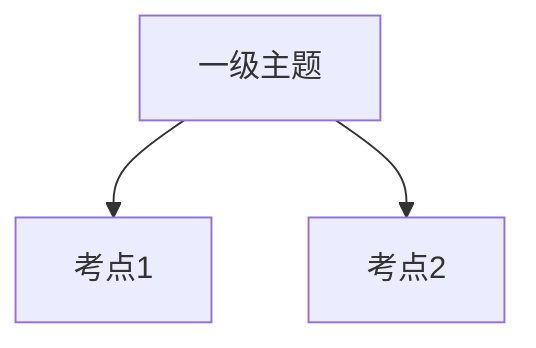

---
tags:
  - 自考/00178
章节: ch01
章节名: 示例章节
重要度: 中
状态: 待核实
更新日期: 2026-09-08
---

# ch01 · 章节名

> 一句话定位：本章在全卷中的角色（如"基础概念章，单选高频、名词解释常考"）。
> 真题定位：见 [[00-考试导航]] 高频分布表；本组题分布在 [[02-历年真题/真题索引]]。

## 本章知识框架

（或用缩进大纲代替，冲刺期建议以可回忆的骨架为主。）

## 考点清单

| 考点 | 常考题型 | 频次/重要度 | 掌握要求 |
|---|---|---|---|
| 考点名 | 单选/简答/计算… | ★★★ | 背诵/理解/辨析 |

## 核心考点卡（问题 → 采分点）

### Q1. 概念名词（常考名解）
**答**：定义 + 一句关键补充。
- 采分点：①②③

### Q2. 高频简答/论述
**答**：分条作答，每条首句即采分点。

## 易错点 / 易混辨析

| 易混组 | 区分要点 |
|---|---|
| A vs B | … |

## 真题连线

- 2023-04 单选第x题（【考点】）→ 详见 [[02-历年真题/2023-04]]
- 2024-10 名词解释第x题 → 详见 [[02-历年真题/2024-10]]

## 背诵速记（可选）

> 口诀 / 压缩句

## 待核实清单

- [ ] 与教材表述对照（页码 __）
